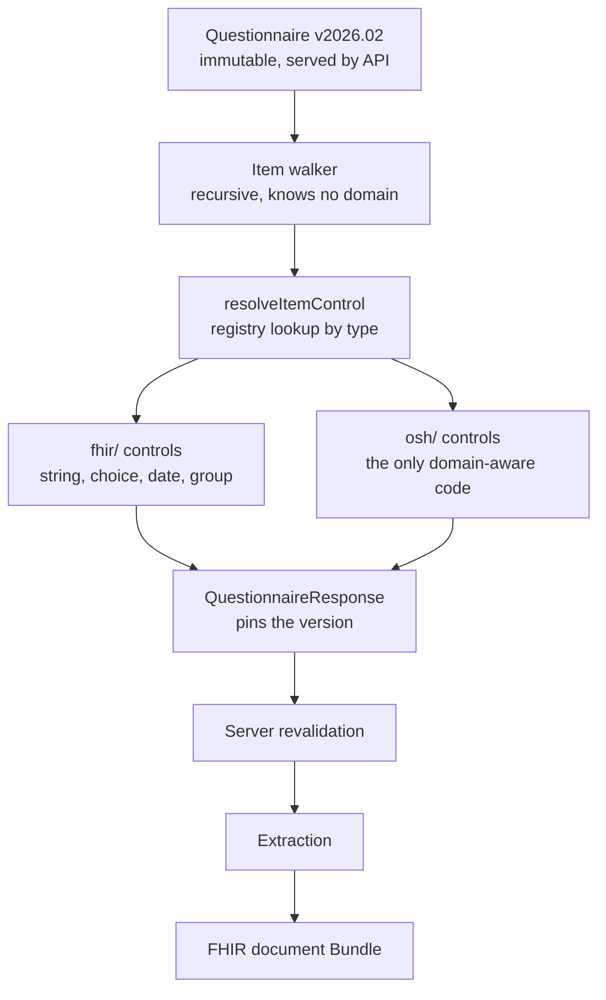

# Developer guide

**Targets** .NET 10 (LTS), C# 14, Firely .NET SDK 6.x, React 19 / Vite, SQL Server.

Both a **walkthrough** — sections 0–8, in dependency order — and a **reference**.
Returning readers should start with the [quick reference](#quick-reference) and
[Appendix F](#appendix-f--decision-log), which records what was decided, what was
rejected, and where the reasoning is weakest.

The system it describes: a medical form is *data*, not code. A FHIR `Questionnaire` is
served as JSON, rendered at runtime by a generic engine, and submitted back as structured
clinical data.

**Assumed background:** comfortable with C#/.NET and React/TypeScript. **No FHIR
knowledge assumed** — [Part I](#part-i--orientation) covers what's needed, in about twenty
minutes.

---

## A note on Firely SDK 6.x

The C# here was written against Firely's documentation rather than verified against a
compiler. The architecture, FHIR semantics, SQL, and TypeScript are sound; the exact
Firely API surface is where to expect friction, because v6 was a major release that
removed the Newtonsoft-based serialization stack.

Treat these as *verify before trusting*:

| Spot | Why | What to do |
|---|---|---|
| `FhirJsonDeserializer` vs `FhirJsonPocoDeserializer` | Renamed during the 5→6 transition | Let IntelliSense complete it. Both may exist, one obsolete. |
| Enum member names (`Questionnaire.QuestionnaireItemType.OpenChoice`, etc.) | Codegen naming has shifted between majors | IntelliSense; the shape is right even if a name isn't |
| `DeserializationFailedException` | Namespace moved in v6 | `Hl7.Fhir.Serialization` is the likely home |

Wherever a Firely type appears, **the concept is correct even if the identifier has
drifted.** If something doesn't resolve, the fix is almost always a rename, not a redesign.
A `// VERIFY:` comment marks each of these points in the code.

---
---

## Table of contents

- [Part I — Orientation](#part-i--orientation)
- [0. Environment and API foundations](#0-environment-and-api-foundations)
- [1. Authoring a Questionnaire](#1-authoring-a-questionnaire)
- [2. Definition storage and serving](#2-definition-storage-and-serving)
- [3. The renderer](#3-the-renderer)
- [4. Conditional logic with FHIRPath](#4-conditional-logic-with-fhirpath)
- [5. Submission and server-side validation](#5-submission-and-server-side-validation)
- [6. Custom item controls](#6-custom-item-controls)
- [7. Extraction into clinical resources](#7-extraction-into-clinical-resources)
- [8. Extensibility verification](#8-extensibility-verification)
- [Quick reference](#quick-reference)
- [Appendix A — FHIR vocabulary](#appendix-a--fhir-vocabulary-you-actually-need)
- [Appendix B — Troubleshooting](#appendix-b--troubleshooting)
- [Appendix C — Where to go next](#appendix-c--where-to-go-next)
- [Appendix D — Things deliberately not built](#appendix-d--things-deliberately-not-built)
- [Appendix E — Naming convention](#appendix-e--naming-convention)
- [Appendix F — Decision log](#appendix-f--decision-log)
- [Appendix G — File inventory](#appendix-g--file-inventory)

---

# Quick reference

Everything below is expanded later. This section is for when you already know the system
and need one fact.

## Ports and commands

```bash
cd api/Osh.Maf.Api && dotnet run     # http://localhost:5080
cd web && npm run dev                # http://localhost:5173 (strictPort)
```

| URL | What |
|---|---|
| `http://localhost:5080/scalar` | Interactive API UI |
| `http://localhost:5080/openapi/v1.json` | Raw OpenAPI document |
| `http://localhost:5173` | The renderer |

The browser only ever talks to 5173; `/fhir/*` is proxied to 5080 inside Node. See
§3.9.

## Folder map

```
maf-poc/
├── api/
│   ├── Osh.Maf.Api/
│   │   ├── Serialization/FhirJson.cs      shared JsonSerializerOptions
│   │   ├── Controllers/                   FHIR façade endpoints
│   │   ├── Validation/                    ResponseValidator
│   │   ├── Extraction/                    QuestionnaireResponse -> resources
│   │   └── Outcomes.cs                    OperationOutcome builders
│   ├── Osh.Maf.Data/                      repositories + .sql migrations
│   └── Osh.Maf.Tests/
├── web/src/
│   ├── index.css                          global tokens + resets — NOT a module
│   ├── App.module.css                     app shell only
│   ├── renderer/                          engine: walks the tree, owns state
│   ├── item-controls/
│   │   ├── contract.ts                    the props contract + RenderMode
│   │   ├── index.ts                       registry + resolveItemControl
│   │   ├── item-controls.module.css       vocabulary shared by every control
│   │   ├── fhir/                          keyed by item.type
│   │   └── osh/                           keyed by item-control extension
│   └── api/                               typed fetch clients
└── definitions/                           *.json Questionnaires
```

## The two seams, and how they are enforced

| Seam | Rule | Enforced by |
|---|---|---|
| Domain knowledge | `renderer/` must not import `item-controls/osh/` | ESLint `no-restricted-imports` (§3.1) |
| FHIR version | Only `contract.ts` imports `fhir/r4` | ESLint `no-restricted-imports` (§3.1) |
| Definition immutability | No `UPDATE` on `FormDefinition` | SQL trigger (§2.2) |
| No asthma in the engine | `grep -ril "asthma\|inhaler\|albuterol" web/src --exclude-dir=osh` | §6.4 checkpoint |
| Style keys resolve | Every `styles.x` has a selector; every selector is used | `npm run audit:css` (§3.9) |

## Naming at a glance

| Thing | Pattern | Example |
|---|---|---|
| Props for one FHIR element's renderer | `<Element>Props` | `QuestionnaireItemProps` |
| Registry-resolvable component | `<Type>Control` | `BooleanControl`, `MedicationOrderControl` |
| The registry map | — | `itemControlRegistry` |
| Resolution function | — | `resolveItemControl` |
| A component's stylesheet | `<Component>.module.css`, beside it | `ChoiceControl.module.css` |
| A folder's shared stylesheet | `<folder-name>.module.css` | `item-controls.module.css` |

Full convention and rationale: Appendix E.

## `item.type` → answer key

| `item.type` | Answer key |
|---|---|
| `string`, `text` | `valueString` |
| `integer` | `valueInteger` |
| `decimal` | `valueDecimal` |
| `boolean` | `valueBoolean` |
| `date` | `valueDate` |
| `dateTime` | `valueDateTime` |
| `time` | `valueTime` |
| `choice` | `valueCoding` |
| `open-choice` | `valueCoding` or `valueString` |
| `quantity` | `valueQuantity` |
| `display`, `group` | *(never answered)* |

## RenderMode

```ts
type RenderMode = 'edit' | 'view' | 'print';
isEditable(mode)   // mode === 'edit'
isReadOnly(mode)   // !isEditable
isPrint(mode)      // mode === 'print'
```

Never compare to a literal in a control. Unrelated to
`QuestionnaireResponse.status` (`in-progress` / `completed` / `amended`), which is
workflow state and lives in the data.

## Endpoints

| Method | Route |
|---|---|
| `GET` | `/fhir/Questionnaire?url={canonical}&version={v}` |
| `GET` | `/fhir/Questionnaire/{id}` |
| `POST` | `/fhir/Questionnaire` — 409 if `(url, version)` exists |
| `POST` | `/fhir/QuestionnaireResponse` — 422 + `OperationOutcome` on validation failure |
| `GET` | `/fhir/Bundle/{responseId}` |

Requests accept `application/fhir+json` **or** `application/json`; responses are always
`application/fhir+json`.

Errors are always `OperationOutcome`. Validation failures set `issue.expression` to the
failing `linkId`; model-binding failures use `issue.diagnostics` (§0.5).

**FHIR JSON forbids empty arrays** — `"answer": []` is a parse error, not an empty value.
The client calls `stripEmpty()` before submitting (§4.4).

---

# Part I — Orientation

Read this part before writing any code. It is short, and every lab assumes it.

## 1. What problem are we solving?

A school nurse needs a doctor's written authorization before giving a child asthma
medication at school. Today that is a two-page paper form that physically travels
between the nurse, the parent, and the doctor, then gets manually retyped into a health
record system.

You could digitize this by building a web form with 120 fields hardcoded in React. That
works — until February, when the form is revised. And again next year. And again when
someone asks for the allergy version, the seizure version, the diabetes version.

So instead: **the form is data.** A JSON document describes what fields exist, what types
they are, and when they appear. A generic engine reads that JSON and renders it. Changing
the form means editing JSON, not shipping a release.

**The analogy:** a hardcoded form is a printing plate — precise, fast, and useless the
moment the text changes. A form engine is a typesetting machine: you hand it a manuscript
and it lays out whatever you gave it.

## 2. Why not invent our own JSON format?

You could. Most teams do, and it works fine for about a year.

Then you hit the second problem: what comes *out* of the form. Health systems don't want
a bag of key-value pairs; they want clinical data with defined meaning — a medication
order with a dose, a route, and a frequency as separate fields, so a computer can check
it, trend it, and act on it.

That means a second format for the output, and a translation layer between them. That
translation layer is where projects die: every new form type needs new translation code,
which quietly undoes the whole point.

FHIR already defines both formats, as a matched pair:

- **`Questionnaire`** — the form definition. What the questions are.
- **`QuestionnaireResponse`** — the filled form. What the answers were.

Same tree structure. Same `linkId`s. Walk one, you can walk the other.

**This is the single most important decision in the project.** If your form definition
format *is* `Questionnaire`, you have one format instead of three and no translation layer.

## 3. What is FHIR, in ninety seconds?

**FHIR** (Fast Healthcare Interoperability Resources, "fire") is HL7's standard for
exchanging health data. Three things to know:

**It's made of Resources.** A Resource is a JSON object describing one health concept —
`Patient`, `Practitioner`, `Condition`, `MedicationRequest`, `Observation`,
`Questionnaire`. Every resource has a `resourceType` field. There are about 150; you will
use eight.

**Resources reference each other.** A `MedicationRequest` has
`subject: { reference: "Patient/123" }`. A graph, not a document tree.

**Version matters.** We use **R4**. When you search for anything, add "R4" — R5 and STU3
examples will not work with our packages.

The smallest real resource:

```json
{
  "resourceType": "Patient",
  "id": "example",
  "name": [{ "family": "Rodriguez", "given": ["Maria"] }],
  "birthDate": "2014-03-12"
}
```

## 4. What is SDC?

**SDC — Structured Data Capture** — is a FHIR Implementation Guide: rules layered on base
FHIR for a specific job. SDC's job is exactly ours.

| Thing | What it is |
|---|---|
| `Questionnaire` | The form definition |
| `QuestionnaireResponse` | The filled form |
| `enableWhen` | Declarative conditional logic |
| Extraction | Turning a response into `MedicationRequest`, `Condition`, etc. |

You are building a small SDC renderer. LHC-Forms, Medplum, Aidbox, and Google's Android
FHIR SDK all do this. We build our own because the point is understanding the mechanism.

## 5. The shape of a Questionnaire

```json
{
  "resourceType": "Questionnaire",
  "url": "http://schools.nyc.gov/osh/Questionnaire/asthma-maf",
  "version": "2026.02",
  "name": "AsthmaMAF",
  "title": "Asthma Medication Administration Form",
  "status": "active",
  "item": [
    {
      "linkId": "student",
      "text": "Student information",
      "type": "group",
      "item": [
        { "linkId": "student.osis", "text": "OSIS number", "type": "string", "required": true },
        { "linkId": "student.dob",  "text": "Date of birth", "type": "date", "required": true }
      ]
    }
  ]
}
```

Five fields carry the weight:

**`url` + `version`** — together they identify one exact, immutable definition. A response
points at `"...asthma-maf|2026.02"`. This is how a form signed in 2026 still renders
correctly in 2031, after four revisions.

**`item`** — a recursive tree. `type: "group"` items have children in their own `item`
array. Everything else is a leaf.

**`linkId`** — unique per item. The join key between definition, response, and validation
errors. Pick a readable convention (`student.osis`) and **never change one after
publishing** — that breaks every response already recorded against that version.

**`type`** — `string`, `text`, `integer`, `decimal`, `boolean`, `date`, `dateTime`,
`time`, `choice`, `open-choice`, `quantity`, `attachment`, `display`, `group`.

**`required`** — combined with `enableWhen`, means "required *if shown*."

## 6. The shape of a QuestionnaireResponse

```json
{
  "resourceType": "QuestionnaireResponse",
  "questionnaire": "http://schools.nyc.gov/osh/Questionnaire/asthma-maf|2026.02",
  "status": "in-progress",
  "item": [
    {
      "linkId": "student",
      "item": [
        { "linkId": "student.osis", "answer": [{ "valueString": "123456789" }] },
        { "linkId": "student.dob",  "answer": [{ "valueDate": "2014-03-12" }] }
      ]
    }
  ]
}
```

Three things:

1. **`questionnaire` pins the version.** Not "the asthma form" — *this exact edition*.
2. **`answer` is an array**, always, because `repeats: true` items can have several.
3. **The answer key encodes the type.**

**A fourth rule that will bite you: FHIR JSON forbids empty arrays.**

```json
"answer": []          ← INVALID. Omit the property entirely.
"item": []            ← INVALID.
"answerOption": []    ← INVALID.
```

A repeating element, *if present*, must have at least one entry. An empty array is a
validation error, not an empty value. Firely's v6 deserializer enforces this strictly and
rejects the whole resource.

This applies in both directions — a hand-authored `Questionnaire` with a stray
`"item": []` fails at publish time for the same reason. §4.4 has the client-side
helper that strips them before submission.

That last point is the number-one beginner stumbling block. Pin this table somewhere:

| `item.type` | Answer key | JSON type |
|---|---|---|
| `string`, `text` | `valueString` | `string` |
| `integer` | `valueInteger` | `number` |
| `decimal` | `valueDecimal` | `number` |
| `boolean` | `valueBoolean` | `boolean` |
| `date` | `valueDate` | `"YYYY-MM-DD"` |
| `dateTime` | `valueDateTime` | ISO 8601 |
| `time` | `valueTime` | `"HH:mm:ss"` |
| `choice` | `valueCoding` | `{ system, code, display }` |
| `open-choice` | `valueCoding` **or** `valueString` | either |
| `quantity` | `valueQuantity` | `{ value, unit, system, code }` |
| `display` | *(never answered)* | — |
| `group` | *(has child items)* | — |

## 7. The architecture



The **item control registry** is the load-bearing idea. The walker doesn't know what an
inhaler is — it reads a `type`, looks up which control handles it, and hands off. All
domain knowledge lives in one folder, `item-controls/osh/`.

**The analogy:** the walker is a switchboard operator who doesn't speak the language. It
reads the extension number and connects the call.

## 8. What you are actually proving

Three claims. Write them on a sticky note:

1. **Runtime rendering** — the React app contains no asthma-specific code.
2. **Zero-code extensibility** — a second, structurally different form renders with no
   code changes outside one folder.
3. **Structured extraction** — a submitted form yields a `MedicationRequest` with a real
   `Dosage` object, not a text blob.

Claim 2 is the one that can come back false. section 8 is where you find out. **A section 8 that
fails is a successful lab.**

---

# 0. Environment and API foundations

**Goal:** a running skeleton. No features.

## 0.1 Prerequisites

- **.NET 10 SDK** (LTS) — `dotnet --version` should report 10.x
- **Visual Studio 2026** (or VS Code / Rider)
- **Node.js 22 LTS** or later
- **SQL Server** — Developer Edition, LocalDB, or the Docker image

## 0.2 Create the structure

```bash
mkdir maf-poc && cd maf-poc
mkdir definitions

cd api
dotnet new sln -n Osh.Maf
```

> **.NET 10 note:** `dotnet new sln` now produces **`.slnx`** (the XML solution format)
> by default rather than `.sln`. Visual Studio 2026 opens it natively. If you need the
> classic format for tooling reasons, pass `--format sln`.

```bash
# .NET 8+ defaults `dotnet new webapi` to MINIMAL APIs.
# We want controllers, so --use-controllers is required, not optional.
dotnet new webapi --use-controllers -n Osh.Maf.Api
dotnet new classlib -n Osh.Maf.Data
dotnet new xunit    -n Osh.Maf.Tests

dotnet sln add Osh.Maf.Api Osh.Maf.Data Osh.Maf.Tests
dotnet add Osh.Maf.Api   reference Osh.Maf.Data
dotnet add Osh.Maf.Tests reference Osh.Maf.Api

# The important one. Version 6.x — the modern System.Text.Json stack.
dotnet add Osh.Maf.Api   package Hl7.Fhir.R4
dotnet add Osh.Maf.Api   package Scalar.AspNetCore
dotnet add Osh.Maf.Tests package Hl7.Fhir.R4
dotnet add Osh.Maf.Data  package Dapper
dotnet add Osh.Maf.Data  package Microsoft.Data.SqlClient
cd ..

npm create vite@latest web -- --template react-ts
cd web
npm install
npm install fhirpath @tanstack/react-query
npm install -D @types/fhir
cd ..
```

> **What is `Hl7.Fhir.R4`?** The Firely .NET SDK. C# classes for every FHIR resource, a
> correct JSON serializer, a FHIRPath engine, and structural validation. Open source, free.
> (Firely also sells a *server* called Vonk — you don't need it.)
>
> **Version 6.x is a major break from 5.x.** The old Newtonsoft-based `FhirJsonParser` /
> `FhirJsonSerializer` are gone or obsolete; everything now runs through
> `System.Text.Json`. If you find a tutorial using `new FhirJsonParser().Parse<T>(...)`,
> it's written for v5. This guide uses the v6 way throughout.
>
> **Do not hand-write FHIR model classes.** FHIR JSON has genuinely surprising rules —
> choice types like `value[x]`, primitive extensions in sibling `_`-prefixed fields — and
> plain `System.Text.Json` defaults will silently produce wrong output.

## 0.3 One options object, shared everywhere

**Do not hand-roll input/output formatters for this.** They are unnecessary. Firely ships a `JsonSerializerOptions` extension that configures both
directions, and ASP.NET already knows how to use one.

Create a single static holder — you will reference it from the API, the tests, and the
repositories:

`api/Osh.Maf.Api/Serialization/FhirJson.cs`:

```csharp
using System.Text.Json;
using Hl7.Fhir.Serialization;   // brings in the ForFhir() extension

namespace Osh.Maf.Api.Serialization;

public static class FhirJson
{
    /// <summary>
    /// Shared, immutable options for all FHIR (de)serialization.
    /// MUST be a single reused instance — creating these per call degrades
    /// performance severely, per Firely's own documentation.
    /// </summary>
    public static readonly JsonSerializerOptions Options =
        new JsonSerializerOptions().ForFhir();
        // VERIFY: if the no-arg overload doesn't resolve, use
        // .ForFhir(Hl7.Fhir.Model.ModelInfo.ModelInspector)

    public static string Serialize<T>(T resource) =>
        JsonSerializer.Serialize(resource, Options);

    public static T Deserialize<T>(string json) =>
        JsonSerializer.Deserialize<T>(json, Options)
            ?? throw new InvalidOperationException("Deserialized to null.");

    /// <summary>Non-generic overload — no reflection needed.</summary>
    public static object? Deserialize(string json, Type type) =>
        JsonSerializer.Deserialize(json, type, Options);
}
```

Then in `Program.cs`:

```csharp
using Hl7.Fhir.Serialization;
using Scalar.AspNetCore;

var builder = WebApplication.CreateBuilder(args);

builder.Services
    .AddControllers()
    .AddJsonOptions(o => o.JsonSerializerOptions.ForFhir());

builder.Services.AddOpenApi(options =>
{
    // Keep FHIR POCOs out of the schema — see §0.5 for why this matters.
    options.AddSchemaTransformer((schema, context, _) =>
    {
        if (typeof(Hl7.Fhir.Model.Base).IsAssignableFrom(context.JsonTypeInfo.Type))
        {
            var t = context.JsonTypeInfo.Type;
            schema.Properties?.Clear();
            schema.Required?.Clear();
            schema.AdditionalPropertiesAllowed = true;
            schema.Description =
                $"FHIR R4 {t.Name}. Post raw application/fhir+json. " +
                $"Spec: http://hl7.org/fhir/R4/{t.Name.ToLowerInvariant()}.html";
        }
        return System.Threading.Tasks.Task.CompletedTask;
    });
});

builder.Services.AddCors(o => o.AddDefaultPolicy(p =>
    p.WithOrigins("http://localhost:5173").AllowAnyHeader().AllowAnyMethod()));

builder.Services.AddSingleton(new FormDefinitionRepository(
    builder.Configuration.GetConnectionString("Maf")!));

var app = builder.Build();

if (app.Environment.IsDevelopment())
{
    app.MapOpenApi();               // /openapi/v1.json
    app.MapScalarApiReference();    // /scalar
}

app.UseCors();
app.MapControllers();
app.Run();
```

That's the whole serialization story. No formatter classes, no `CanReadType`, no
`MakeGenericMethod`.

> **Why `AddJsonOptions` rather than custom formatters?** `ForFhir()` configures a
> `JsonSerializerOptions` with FHIR's converters, and ASP.NET's built-in
> `System.Text.Json` formatter then handles both request binding and response writing.
> A custom `TextInputFormatter` re-implements what the framework already does, and the
> non-generic `JsonSerializer.Deserialize(string, Type, options)` overload removes the
> only reason people reach for reflection there.
>
> **The tradeoff:** this applies FHIR serialization to *every* controller. Every endpoint
> in this POC is FHIR, so that's fine. If you later add non-FHIR admin endpoints, you'd
> move to per-route options or bring back a formatter scoped to `application/fhir+json`.

## 0.4 Project settings

`api/Directory.Build.props`:

```xml
<Project>
  <PropertyGroup>
    <TargetFramework>net10.0</TargetFramework>
    <LangVersion>latest</LangVersion>
    <Nullable>enable</Nullable>
    <ImplicitUsings>enable</ImplicitUsings>
    <TreatWarningsAsErrors>false</TreatWarningsAsErrors>
  </PropertyGroup>
</Project>
```

`api/Osh.Maf.Api/appsettings.Development.json`:

```json
{
  "ConnectionStrings": {
    "Maf": "Server=(localdb)\\mssqllocaldb;Database=MafPoc;Trusted_Connection=True;TrustServerCertificate=True"
  }
}
```

## 0.5 Scalar: an interactive UI for the façade

Swagger is no longer bundled in the .NET 10 templates; `Microsoft.AspNetCore.OpenApi` is
built in, and Scalar renders a UI over it. The three lines are already in the `Program.cs`
above. Navigate to `http://localhost:5080/scalar`.

Optionally open it automatically — in `launchSettings.json`:

```json
"launchBrowser": true,
"launchUrl": "scalar",
```

### Why the schema transformer is not optional

Without it, the generator reflects over the Firely POCO bound to
`[FromBody] Questionnaire q` and pulls in:

- `Questionnaire.item` → `item` → `item`, recursive without bound
- Every FHIR datatype reachable from it — `Coding`, `CodeableConcept`, `Quantity`,
  `Reference`, `Extension`, `Period`, `Range`, and onward
- `Extension.value`, typed as `DataType`, the base class of roughly forty concrete types

You get an OpenAPI document in the hundreds of schemas and a UI that takes seconds to
render a form nobody would fill in by hand.

**The generated schema would also be wrong.** FHIR's `value[x]` choice pattern serializes
as `valueString` / `valueInteger` / `valueCoding` — a shape that reflection over a
`DataType` property cannot express. A confidently wrong schema is worse than an opaque one.

So the transformer collapses every `Base`-derived type to a plain object with a link to
the spec. You lose request-body autocomplete you never had usefully, and gain a UI that
loads instantly and lets you paste a definition into the body and hit send. For a POC
that is the entire value: **try-it-out, not documentation.**

> The `GET` endpoints need no help — they return
> `Content(row.DefinitionJson, "application/fhir+json")`, so there is no typed model to
> reflect over in the first place.

### Declare the response types

The transformer handles request bodies; `[ProducesResponseType]` handles responses. Add
these as you build each controller:

```csharp
[HttpPost]
[Consumes("application/fhir+json", "application/json")]
[ProducesResponseType(typeof(Questionnaire),      StatusCodes.Status201Created)]
[ProducesResponseType(typeof(OperationOutcome),   StatusCodes.Status400BadRequest)]
[ProducesResponseType(typeof(OperationOutcome),   StatusCodes.Status409Conflict)]
public async Task<IActionResult> Publish([FromBody] Questionnaire q)
```

> **Accept both content types; emit only one.** FHIR's own type is
> `application/fhir+json`, but every tool defaults to `application/json` — Scalar,
> `curl -d`, `fetch` without an explicit header. Listing only the FHIR type in
> `[Consumes]` produces a **415 with an empty body**, which is confusing and needless.
>
> The formatter side already copes: ASP.NET's System.Text.Json input formatter registers
> `application/json`, `text/json`, and the wildcard `application/*+json` — which matches
> `application/fhir+json`. `[Consumes]` was the only thing narrowing it.
>
> Be liberal in what you accept, strict in what you emit.

### Declare the response content type once

Without `[Produces]`, ASP.NET advertises whatever its output formatters *could* emit —
`text/plain, application/json, text/json`. Scalar reads that from the OpenAPI document and
sends it as the `Accept` header. Harmless at runtime, but the published spec is then wrong
about your API.

Every endpoint here emits `application/fhir+json`, so set it globally rather than
decorating each action:

```csharp
builder.Services
    .AddControllers(options =>
    {
        options.Filters.Add(new ProducesAttribute("application/fhir+json"));
    })
    .AddJsonOptions(o => o.JsonSerializerOptions.ForFhir());
```

For `QuestionnaireResponseController`: `201`, `422`, `400` on `POST`; `200`, `404`, `409`,
`422` on `PUT`. Every error is an `OperationOutcome` — declaring it makes the failure
contract visible in the UI, which is the part a reviewer actually cares about.

### Pin Microsoft.OpenApi to 2.3.9

There is a reported incompatibility on .NET 10: with `Microsoft.OpenApi` 3.0.0, adding
`Scalar.AspNetCore` throws at startup with
`Property or indexer 'IOpenApiMediaType.Example' cannot be assigned to -- it is read only`.
Downgrading to 2.3.9 resolves it.

In `api/Osh.Maf.Api/Osh.Maf.Api.csproj`:

```xml
<PackageReference Include="Microsoft.OpenApi" Version="2.3.9" />
```

An explicit reference overrides the transitive version .NET 10 would otherwise pull in.

> **Check whether you still need this.** The pin was necessary as of this writing; it may
> be fixed. Try without it first — if the app starts and `/scalar` renders, delete the
> line. Leaving a stale pin in place is its own maintenance problem.
>
> If the schema transformer's `schema.Type` assignment doesn't compile, that is the same
> 2.x/3.x divide: Microsoft.OpenApi 3.x replaced the string `Type` with a
> `JsonSchemaType` enum. On 2.3.9 the code above is correct as written.

### Close the ProblemDetails leak

Scalar will find this within about a minute of use, so fix it now.

Send a `GET /fhir/Questionnaire` with no `url` parameter. You get:

```json
{
  "type": "https://tools.ietf.org/html/rfc9110#section-15.5.1",
  "title": "One or more validation errors occurred.",
  "status": 400,
  "errors": { "url": [ "The url field is required." ] }
}
```

That is `application/problem+json` — ASP.NET's built-in `ProblemDetails`. Our rule is that
**every `/fhir/*` error is an `OperationOutcome`**, and it just got broken.

**Why `Outcomes.*` didn't catch it.** `[ApiController]` short-circuits on model-binding
failure and returns its automatic 400 *before any of your controller code runs*. Your
`Outcomes` helpers only cover errors you raise yourself. Anything failing during binding
bypasses them: a missing required query parameter, an unparseable GUID in a route
constraint, malformed JSON in a request body.

That last one is the reason this matters rather than being a curiosity. From section 6 onward
you will be posting hand-authored Questionnaires of a hundred-plus fields. A trailing
comma is a binding failure, and you want that error to look like every other error your
API produces.

Add to `Program.cs`:

```csharp
using Microsoft.AspNetCore.Mvc;

builder.Services.Configure<ApiBehaviorOptions>(options =>
{
    options.InvalidModelStateResponseFactory = context =>
    {
        var messages = context.ModelState
            .Where(kv => kv.Value?.Errors.Count > 0)
            .SelectMany(kv => kv.Value!.Errors.Select(e =>
                string.IsNullOrWhiteSpace(kv.Key)
                    ? e.ErrorMessage
                    : $"{kv.Key}: {e.ErrorMessage}"));

        return new ObjectResult(Outcomes.FromMessages(messages))
        {
            StatusCode  = StatusCodes.Status400BadRequest,
            ContentTypes = { "application/fhir+json" }
        };
    };
});
```

And the matching helper in `Outcomes.cs` (§2.4):

```csharp
public static OperationOutcome FromMessages(IEnumerable<string> messages) => new()
{
    Issue = messages.Select(m => new OperationOutcome.IssueComponent
    {
        Severity    = OperationOutcome.IssueSeverity.Error,
        Code        = OperationOutcome.IssueType.Invalid,
        Diagnostics = m
    }).ToList()
};
```

> **This is deliberately not `Outcomes.FromIssues`.** That one sets `issue.expression`,
> which in FHIR is a **FHIRPath expression pointing into the submitted resource**. Correct
> for a failing `linkId` in section 5; wrong for a query parameter name, which is not part of
> any resource. Binding errors belong in `diagnostics`.

### Surface Firely's real parse errors

ASP.NET reports a failed body bind as *"The supplied value is invalid"* — useless when the
body is a hand-authored 120-field Questionnaire. Firely's `DeserializationFailedException`
carries the actual issues, element by element. Unwrap them.

If you kept a custom input formatter, catch it there. Otherwise add an exception filter:

```csharp
using Hl7.Fhir.Serialization;

public sealed class FhirDeserializationFilter : IExceptionFilter
{
    public void OnException(ExceptionContext context)
    {
        if (context.Exception is not DeserializationFailedException dfe) return;

        context.Result = new ObjectResult(
            Outcomes.FromMessages(dfe.Exceptions.Select(e => e.Message)))
        {
            StatusCode   = StatusCodes.Status400BadRequest,
            ContentTypes = { "application/fhir+json" }
        };
        context.ExceptionHandled = true;
    }
}
```

Register it alongside the `ProducesAttribute` filter above:

```csharp
options.Filters.Add<FhirDeserializationFilter>();
```

> **VERIFY:** the collection property on `DeserializationFailedException` is `Exceptions`
> in the versions checked; let IntelliSense confirm. The shape — a list of per-element
> issues — is what matters.

Instead of *"The supplied value is invalid"* you get *"Expected an object at
item[2].answer, found an empty array"*, which is the difference between a two-minute fix
and an afternoon.

### The third error tier

Adding the two content types above makes 415 nearly unreachable, but it is worth knowing
the shape of the problem. There are three tiers of failure and each is handled somewhere
different:

| Tier | Example | Handled by |
|---|---|---|
| Your controller | 404, 409, 422 | `Outcomes.*` |
| Model binding | missing parameter, malformed JSON | `InvalidModelStateResponseFactory` |
| Content negotiation | 415, 406 | **nothing by default** |

415 is produced by the negotiation layer, *before* model binding, so neither of the first
two catches it — you get a bare status code with an empty body. Optional belt-and-braces,
registered before `app.MapControllers()`:

```csharp
app.Use(async (ctx, next) =>
{
    await next();
    if (ctx.Response.StatusCode >= 400
        && !ctx.Response.HasStarted
        && ctx.Response.ContentLength is null or 0
        && ctx.Request.Path.StartsWithSegments("/fhir"))
    {
        ctx.Response.ContentType = "application/fhir+json";
        await ctx.Response.WriteAsync(FhirJson.Serialize(
            Outcomes.FromMessages(
                [$"Request failed with status {ctx.Response.StatusCode}."])));
    }
});
```

> **Scope caveat.** This applies to every controller in the app. Fine now — everything
> lives under `/fhir`. If you add non-FHIR admin endpoints later, gate the factory on
> `context.HttpContext.Request.Path.StartsWithSegments("/fhir")` and fall through to the
> default `ProblemDetails` otherwise.

### What not to build here

FHIR has its own API-description mechanism — a `CapabilityStatement` served at
`GET /fhir/metadata`. It is what a FHIR client looks for, and it is machine-readable in
the way the ecosystem expects.

It is **not** an interactive UI, so it does not replace Scalar; different jobs. Skip it
until Phase 6 or your first real integration conversation. It is on the "do not build"
list (Appendix D) because it is the first step toward a conformant FHIR server, which the
architecture explicitly declined.

## 0.6 Verify

`dotnet build` in `api/`. `npm run dev` in `web/`. Both succeed.

`dotnet run` in `Osh.Maf.Api`, then open `http://localhost:5080/scalar`. You should see
the endpoint list render immediately. If it hangs or the page is enormous, the schema
transformer isn't being applied — check that `AddSchemaTransformer` is inside the
`AddOpenApi` lambda and that `Base` resolves to `Hl7.Fhir.Model.Base`.

If `ForFhir()` doesn't resolve, check that `using Hl7.Fhir.Serialization;` is present and
that the package restored as 6.x, not 5.x.

### Exercise the error paths

Come back to this once section 2 has published the toy definition. **Tick the checkbox next to
each query parameter** — Scalar only sends rows that are ticked, and an unticked row
silently sends nothing, which looks exactly like a broken endpoint.

| Request | Expect | Reaches your controller? |
|---|---|---|
| `?url=…/toy&version=1.0` | 200 + the Questionnaire | yes |
| `?url=…/toy` (no version) | 200 + latest `active` | yes |
| no parameters at all | 400 + `OperationOutcome` | **no** — binding |
| `?url=…/nope` | 404 + `OperationOutcome` | yes |
| `?url=…/toy&version=9.9` | 404 + `OperationOutcome` | yes |
| `GET /fhir/Questionnaire/not-a-guid` | 404 | **no** — route constraint |
| `POST` a Questionnaire with no `version` | 400 + `OperationOutcome` | yes |
| `POST` JSON with a trailing comma | 400 + `OperationOutcome` | **no** — binding |
| `POST` a response containing `"answer": []` | 400 + `OperationOutcome` | **no** — binding |
| `POST` with `content-type: text/plain` | 415 | **no** — negotiation |

Every body must be `application/fhir+json`. If any row returns
`application/problem+json`, the `InvalidModelStateResponseFactory` above isn't wired up.

> **This is the point of having the UI.** Your React client only ever exercises the happy
> path, because you wrote both ends of it. Scalar lets you send requests your own code
> would never construct, and that is where the interesting failures live. The three rows
> marked "no" above are all invisible from the front end.

---

# 1. Authoring a Questionnaire

**Goal:** understand `Questionnaire` by writing one, and prove it parses.

> **Resist the urge to model the whole asthma MAF yet.** Build a four-question toy form
> first and get it end-to-end. You'll learn the mechanism in an hour instead of fighting
> a 120-field document while also debugging a renderer you've never run. Asthma arrives
> in section 6.

## 1.1 Write it

`definitions/toy-form-1.0.json`:

```json
{
  "resourceType": "Questionnaire",
  "url": "http://schools.nyc.gov/osh/Questionnaire/toy",
  "version": "1.0",
  "name": "ToyForm",
  "title": "Toy Form",
  "status": "active",
  "item": [
    { "linkId": "name", "text": "What is your name?", "type": "string", "required": true },
    { "linkId": "age",  "text": "How old are you?",   "type": "integer" },
    { "linkId": "likes-cake", "text": "Do you like cake?", "type": "boolean" },
    {
      "linkId": "cake-flavour",
      "text": "Which flavour?",
      "type": "choice",
      "enableWhen": [
        { "question": "likes-cake", "operator": "=", "answerBoolean": true }
      ],
      "answerOption": [
        { "valueCoding": { "code": "choc",   "display": "Chocolate" } },
        { "valueCoding": { "code": "vanil",  "display": "Vanilla" } },
        { "valueCoding": { "code": "carrot", "display": "Carrot" } }
      ]
    }
  ]
}
```

Read that `enableWhen` as: *show this item when the answer to `likes-cake` equals `true`.*

## 1.2 Prove it parses

`api/Osh.Maf.Tests/QuestionnaireParsingTests.cs`:

```csharp
using Hl7.Fhir.Model;
using Osh.Maf.Api.Serialization;
using Xunit;

namespace Osh.Maf.Tests;

public class QuestionnaireParsingTests
{
    private static string DefinitionsDir =>
        Path.GetFullPath(Path.Combine(AppContext.BaseDirectory, "../../../../../definitions"));

    private static Questionnaire Load(string file) =>
        FhirJson.Deserialize<Questionnaire>(File.ReadAllText(Path.Combine(DefinitionsDir, file)));

    [Fact]
    public void ToyForm_Parses()
    {
        var q = Load("toy-form-1.0.json");

        Assert.Equal("1.0", q.Version);
        Assert.Equal(4, q.Item.Count);
        Assert.True(q.Item[0].Required);
    }

    [Fact]
    public void AllLinkIds_AreUnique()
    {
        var ids = Flatten(Load("toy-form-1.0.json").Item).Select(i => i.LinkId).ToList();
        Assert.Equal(ids.Count, ids.Distinct().Count());
    }

    [Fact]
    public void RoundTrips_WithoutLoss()
    {
        var q = Load("toy-form-1.0.json");
        var again = FhirJson.Deserialize<Questionnaire>(FhirJson.Serialize(q));
        Assert.True(q.IsExactly(again));
    }

    internal static IEnumerable<Questionnaire.ItemComponent> Flatten(
        IEnumerable<Questionnaire.ItemComponent>? items) =>
        (items ?? []).SelectMany(i => new[] { i }.Concat(Flatten(i.Item)));
}
```

Note `Flatten`. You will write this recursion, in some form, in almost every file of this
project. The `Questionnaire` is a tree and virtually every operation is a tree walk.

> **`IsExactly`** is Firely's deep structural equality on any `Base`. It is far more
> useful in tests than comparing JSON strings, which are sensitive to key order.

## 1.3 Break it deliberately

Change `"type": "integer"` to `"type": "intiger"`. Re-run. It should fail.

Worth doing once, because it tells you something useful: **the Firely deserializer is
your first line of validation.** A malformed definition never reaches your code.

> **v6 is stricter than v5 was.** The System.Text.Json stack rejects things the old
> Newtonsoft one tolerated — quoted numbers (`"age": "12"`), JSON comments. You're about
> to hand-author a large `Questionnaire`, so expect the parser to be less forgiving than
> examples you find online. That's the behaviour you want: rejected at publish time
> rather than silently coerced.

## 1.4 Verify

Three green tests. You can read a `Questionnaire` and you understand the item tree.

---

# 2. Definition storage and serving

**Goal:** definitions live in SQL Server, immutably, and the API serves them.

## 2.1 Why immutability matters

This is a legal requirement, not an engineering preference.

A signed medication order must render exactly as it was signed — years later, in a
lawsuit, after three revisions. If you `UPDATE` a definition row, every response already
recorded against it now renders against different questions. The data silently becomes a
lie.

So: **definitions are insert-only.** A revision is a new row with a new `version`. We
enforce that in the database, not just in the repository class, because the database
survives a refactor.

**The analogy:** a signed contract references a specific edition of the terms. You don't
get to rewrite the terms afterwards and claim the signature still stands.

## 2.2 Schema

`api/Osh.Maf.Data/Migrations/001_FormDefinition.sql`:

```sql
CREATE TABLE dbo.FormDefinition (
    FormDefinitionId  UNIQUEIDENTIFIER NOT NULL PRIMARY KEY DEFAULT NEWID(),
    CanonicalUrl      NVARCHAR(400)    NOT NULL,
    Version           NVARCHAR(40)     NOT NULL,
    Title             NVARCHAR(200)    NOT NULL,
    Status            NVARCHAR(20)     NOT NULL,
    DefinitionJson    NVARCHAR(MAX)    NOT NULL,
    PublishedUtc      DATETIME2        NOT NULL DEFAULT SYSUTCDATETIME(),
    CONSTRAINT UQ_FormDefinition UNIQUE (CanonicalUrl, Version),
    CONSTRAINT CK_FormDefinition_Json CHECK (ISJSON(DefinitionJson) = 1)
);
GO

CREATE TRIGGER dbo.TR_FormDefinition_NoUpdate ON dbo.FormDefinition
INSTEAD OF UPDATE AS
BEGIN
    THROW 50001, 'Form definitions are immutable. Publish a new version.', 1;
END;
GO
```

> `ISJSON()` and `JSON_VALUE()` are SQL Server's built-in JSON functions. We store JSON in
> `NVARCHAR(MAX)` and index only the fields we filter on, via persisted computed columns
> (you'll see one in section 5). Don't try to index the JSON generally — your queries will be
> by workflow status, and that's relational.

Apply it however you like — SSMS, `sqlcmd`, or a tiny runner. There's no migration
framework in this section on purpose.

## 2.3 Repository

`api/Osh.Maf.Data/FormDefinitionRepository.cs`:

```csharp
using Dapper;
using Microsoft.Data.SqlClient;

namespace Osh.Maf.Data;

public sealed record FormDefinitionRow(
    Guid FormDefinitionId, string CanonicalUrl, string Version,
    string Title, string Status, string DefinitionJson, DateTime PublishedUtc);

public sealed class FormDefinitionRepository(string connectionString)
{
    private SqlConnection Conn() => new(connectionString);

    public async Task<FormDefinitionRow?> GetAsync(string url, string? version)
    {
        await using var c = Conn();
        return version is null
            ? await c.QueryFirstOrDefaultAsync<FormDefinitionRow>(
                """
                SELECT TOP 1 * FROM dbo.FormDefinition
                WHERE CanonicalUrl = @url AND Status = 'active'
                ORDER BY PublishedUtc DESC
                """, new { url })
            : await c.QueryFirstOrDefaultAsync<FormDefinitionRow>(
                """
                SELECT * FROM dbo.FormDefinition
                WHERE CanonicalUrl = @url AND Version = @version
                """, new { url, version });
    }

    public async Task<FormDefinitionRow?> GetByIdAsync(Guid id)
    {
        await using var c = Conn();
        return await c.QueryFirstOrDefaultAsync<FormDefinitionRow>(
            "SELECT * FROM dbo.FormDefinition WHERE FormDefinitionId = @id", new { id });
    }

    public async Task<Guid> InsertAsync(
        string url, string version, string title, string status, string json)
    {
        await using var c = Conn();
        var id = Guid.NewGuid();
        await c.ExecuteAsync(
            """
            INSERT INTO dbo.FormDefinition
              (FormDefinitionId, CanonicalUrl, Version, Title, Status, DefinitionJson)
            VALUES (@id, @url, @version, @title, @status, @json)
            """,
            new { id, url, version, title, status, json });
        return id;
    }
}
```

> **C# 11+ raw string literals** (`"""`) are worth using for embedded SQL — no escaping,
> and the indentation is stripped relative to the closing delimiter.
>
> `await using` on the connection rather than `using`: `SqlConnection` implements
> `IAsyncDisposable`, and async disposal avoids blocking the thread on close.

## 2.4 Controller

`api/Osh.Maf.Api/Controllers/QuestionnaireController.cs`:

```csharp
using Hl7.Fhir.Model;
using Microsoft.AspNetCore.Mvc;
using Osh.Maf.Data;
using Osh.Maf.Api.Serialization;
using Task = System.Threading.Tasks.Task;   // FHIR has its own Task resource!

namespace Osh.Maf.Api.Controllers;

[ApiController]
[Route("fhir/Questionnaire")]
public sealed class QuestionnaireController(FormDefinitionRepository repo) : ControllerBase
{
    [HttpGet]
    public async Task<IActionResult> Search(
        [FromQuery] string url, [FromQuery] string? version)
    {
        var row = await repo.GetAsync(url, version);
        if (row is null)
            return NotFound(Outcomes.NotFound($"No Questionnaire for {url}"));

        // Return the STORED bytes, not a round-trip. See note below.
        return Content(row.DefinitionJson, "application/fhir+json");
    }

    [HttpGet("{id:guid}")]
    public async Task<IActionResult> GetById(Guid id)
    {
        var row = await repo.GetByIdAsync(id);
        return row is null
            ? NotFound(Outcomes.NotFound($"No Questionnaire {id}"))
            : Content(row.DefinitionJson, "application/fhir+json");
    }

    [HttpPost]
    public async Task<IActionResult> Publish([FromBody] Questionnaire q)
    {
        if (string.IsNullOrWhiteSpace(q.Url) || string.IsNullOrWhiteSpace(q.Version))
            return BadRequest(Outcomes.Invalid("url and version are required."));

        if (await repo.GetAsync(q.Url, q.Version) is not null)
            return Conflict(Outcomes.Conflict(
                $"{q.Url}|{q.Version} already exists. Definitions are immutable."));

        var id = await repo.InsertAsync(
            q.Url, q.Version,
            q.Title ?? q.Name ?? "Untitled",
            q.Status?.ToString().ToLowerInvariant() ?? "draft",
            FhirJson.Serialize(q));

        return Created($"/fhir/Questionnaire/{id}", q);
    }
}
```

> **Name the action parameter meaningfully.** ASP.NET puts the parameter name into
> binding errors — `[FromBody] QuestionnaireResponse r` yields *"r: The r field is
> required"*, which tells the reader nothing. `response` yields *"response: The response
> field is required"*, which at least names the body.

> **`using Task = System.Threading.Tasks.Task;`** — FHIR R4 has a resource called `Task`,
> and `using Hl7.Fhir.Model;` brings it into scope. Without the alias, every
> `async Task<IActionResult>` in a file that also touches FHIR model types becomes
> ambiguous. You will hit this. Put the alias at the top of every controller.

`api/Osh.Maf.Api/Outcomes.cs`:

```csharp
using Hl7.Fhir.Model;

namespace Osh.Maf.Api;

public static class Outcomes
{
    public static OperationOutcome NotFound(string msg) =>
        Single(OperationOutcome.IssueType.NotFound, msg);

    public static OperationOutcome Invalid(string msg) =>
        Single(OperationOutcome.IssueType.Invalid, msg);

    public static OperationOutcome Conflict(string msg) =>
        Single(OperationOutcome.IssueType.Conflict, msg);

    public static OperationOutcome FromIssues(
        IEnumerable<(string LinkId, string Message)> issues) => new()
    {
        Issue = issues.Select(i => new OperationOutcome.IssueComponent
        {
            Severity    = OperationOutcome.IssueSeverity.Error,
            Code        = OperationOutcome.IssueType.Invalid,
            Diagnostics = i.Message,
            Expression  = [i.LinkId]     // the client keys off this
        }).ToList()
    };

    /// <summary>
    /// For model-binding failures (see the InvalidModelStateResponseFactory in
    /// §0.5). Uses diagnostics rather than expression, because a query
    /// parameter name is not a FHIRPath expression into a resource.
    /// </summary>
    public static OperationOutcome FromMessages(IEnumerable<string> messages) => new()
    {
        Issue = messages.Select(m => new OperationOutcome.IssueComponent
        {
            Severity    = OperationOutcome.IssueSeverity.Error,
            Code        = OperationOutcome.IssueType.Invalid,
            Diagnostics = m
        }).ToList()
    };

    private static OperationOutcome Single(
        OperationOutcome.IssueType code, string msg) => new()
    {
        Issue =
        [
            new OperationOutcome.IssueComponent
            {
                Severity    = OperationOutcome.IssueSeverity.Error,
                Code        = code,
                Diagnostics = msg
            }
        ]
    };
}
```

> **Why `OperationOutcome` instead of a normal error body?** It's FHIR's standard error
> resource. Any FHIR-aware client knows how to read it, and `issue.expression` can carry
> the `linkId` of the failing field so the UI highlights the right box.
>
> **Why return stored JSON verbatim on `GET`?** Round-tripping through the SDK normalizes
> whitespace and key order. The definition is a legal artifact — return the bytes you
> stored.

## 2.5 Verify

```bash
curl -X POST http://localhost:5000/fhir/Questionnaire \
  -H "Content-Type: application/fhir+json" \
  --data-binary @definitions/toy-form-1.0.json
# 201

# same again
# 409 with an OperationOutcome
```

Then `UPDATE dbo.FormDefinition SET Title='x'` in SSMS. It should throw.

---

# 3. The renderer

**Goal:** the heart of the project. A React component that renders *any* `Questionnaire`.

## 3.1 Folder layout and the two rules that hold it together

```
web/src/
├── renderer/              the engine: walks the tree, owns state
│   ├── QuestionnaireRenderer.tsx
│   ├── QuestionnaireItemWalker.tsx
│   ├── useResponseState.ts
│   ├── useEnableWhen.ts
│   ├── clientValidation.ts
│   └── RenderMode.tsx
└── item-controls/         the leaves: one component per item type
    ├── contract.ts        QuestionnaireItemProps, QuestionnaireItemControl, RenderMode
    ├── index.ts           the registry map + resolveItemControl
    ├── item-controls.module.css   vocabulary shared by every control (§3.9)
    ├── fhir/              keyed by item.type — standard, domain-free
    │   ├── StringControl.tsx
    │   ├── ChoiceControl.tsx
    │   ├── ChoiceControl.module.css    styles for that control alone
    │   └── ...
    └── osh/               keyed by the item-control extension — THE ONLY
        ├── MedicationOrderControl.tsx      domain-aware code in the app
        ├── MedicationOrderControl.module.css
        └── ...
```

> **Why these names?** `item-controls` is SDC's own term — FHIR defines a
> `questionnaire-itemControl` extension meaning "the widget that renders this item," and
> your `OSH_ITEM_CONTROL` URL is a local version of exactly that. `fhir/` vs `osh/`
> mirrors the two keys `resolveItemControl` branches on: a standard `item.type`, or a
> local extension code. The directory tree is a diagram of the lookup rule.
>
> Appendix E has the full convention and the reasoning behind each choice.

Two lint rules keep the seams honest. `web/eslint.config.js` (flat config — the Vite
React-TS template ships this now):

```js
export default [
  // ...existing config

  // Rule 1: the engine stays domain-agnostic.
  {
    files: ['src/renderer/**/*.{ts,tsx}'],
    rules: {
      'no-restricted-imports': ['error', {
        patterns: [{
          group: ['**/item-controls/osh/**', '**/osh/**'],
          message:
            'renderer/ must stay domain-agnostic. Register an item control instead.'
        }]
      }]
    }
  },

  // Rule 2: FHIR types enter through exactly one file.
  {
    files: ['src/**/*.{ts,tsx}'],
    ignores: ['src/item-controls/contract.ts'],
    rules: {
      'no-restricted-imports': ['error', {
        paths: [{
          name: 'fhir/r4',
          message:
            'Import FHIR types from item-controls/contract.ts — one version-change point.'
        }]
      }]
    }
  }
];
```

Rule 1 is what makes claim 2 testable rather than aspirational. Without it, someone adds
`if (linkId === 'albuterol-dose')` in the walker at 5pm on a Friday and nobody notices
until section 8.

Rule 2 means an R4 → R5 migration is one file plus whatever genuinely differs, instead of
a find-and-replace across forty components.

## 3.2 The item control contract

`web/src/item-controls/contract.ts`:

```ts
import type {
  Questionnaire,
  QuestionnaireItem,
  QuestionnaireResponse,
  QuestionnaireResponseItem,
  QuestionnaireResponseItemAnswer,
} from 'fhir/r4';
import type { FC, ReactNode } from 'react';

/**
 * Single import point for FHIR types. Every other file in the app imports
 * from here, never from 'fhir/r4' directly — see lint rule 2 in §3.1.
 * An R4 -> R5 move changes this block and nothing else.
 */
export type {
  Questionnaire,
  QuestionnaireItem,
  QuestionnaireResponse,
  QuestionnaireResponseItem,
  QuestionnaireResponseItemAnswer,
};

/**
 * How a render is presented. Purely a UI concern — unrelated to
 * QuestionnaireResponse.status, which carries workflow state.
 *
 * Two underlying axes: is it editable, and what medium is it for. The fourth
 * combination (editable on paper) is nonsense, so this is a flat three-value
 * union rather than a pair of booleans.
 */
export type RenderMode = 'edit' | 'view' | 'print';

/** True when the user can change answers. */
export const isEditable = (mode: RenderMode): boolean => mode === 'edit';

/** True when answers are displayed but not changeable. */
export const isReadOnly = (mode: RenderMode): boolean => !isEditable(mode);

/** True when rendering for paper rather than screen. */
export const isPrint = (mode: RenderMode): boolean => mode === 'print';

/** Props for a component that renders one Questionnaire.item. */
export interface QuestionnaireItemProps {
  item: QuestionnaireItem;
  answers: QuestionnaireResponseItemAnswer[];
  setAnswers: (answers: QuestionnaireResponseItemAnswer[]) => void;
  errors: string[];
  mode: RenderMode;
  children?: ReactNode;   // populated only for group items
}

/** A component that renders one Questionnaire.item. */
export type QuestionnaireItemControl = FC<QuestionnaireItemProps>;
```

> **Why `QuestionnaireItemProps` and not `ItemProps`?** FHIR has many things called
> `item`. `QuestionnaireResponse.item` is a different type and appears in the same files;
> `Claim.item` and `List.entry.item` exist too. Naming the type after the exact FHIR
> element it wraps means a reader never has to guess which `item` you meant.
>
> **Keep this interface narrow, and defend it.** It is the entire API surface available to
> an item control. If a control needs the whole response, or an API client, or routing —
> it is doing something that doesn't belong in `item-controls/`. Every widening of
> `QuestionnaireItemProps` is a small leak of domain logic into the generic layer.
>
> `answers` is an array. Always. Items with `repeats: true` have several, and you do not
> want two code paths.

> **Why predicates instead of comparing to `'edit'` directly?** Every control needs a
> read-only branch. Written as `mode !== 'edit'`, that is a negative check against one
> value — add a fourth mode later (a compact `summary` card for the nurse's queue, say)
> and every control silently falls into its read-only branch. You would find it visually,
> one component at a time. `isReadOnly(mode)` makes adding a mode one line in one file.
>
> The OpenMRS engine reached the same conclusion: its `isViewMode()` helper collapses
> `view` and `embedded-view`. It applies the helper inconsistently, though — raw
> `sessionMode === 'view'` comparisons remain scattered through its sidebar. **Define the
> predicate and use it exclusively**; half-adopting is worse than not having it, because
> you can no longer grep for the sites that need updating.

> **`mode` is form-wide. A future `readOnly` will be per-item.** They are different axes
> and neither can express the other. The form can be in `edit` while a given item is
> locked — the practitioner's order shown to a parent, a pre-populated date of birth, a
> calculated dose. They compose as `isEditable(mode) && !readOnly`.
>
> This is also distinct from `enableWhen`: a read-only item is still **rendered and still
> submitted**, whereas a disabled item is neither. Modelling "not mine to edit" with
> `enableWhen` would drop the answer from the response entirely.
>
> Not built yet — it is first needed for the parallel lanes in section 6/Phase 6. Recorded
> here so nobody reaches for a fourth `RenderMode` value when that requirement arrives.

## 3.3 Response state

`web/src/renderer/useResponseState.ts`:

```ts
import { useState, useCallback, useMemo } from 'react';
import type {
  Questionnaire, QuestionnaireItem, QuestionnaireResponse,
  QuestionnaireResponseItem, QuestionnaireResponseItemAnswer
} from 'fhir/r4';

/** Build an empty response mirroring the questionnaire's item tree. */
function scaffold(items: QuestionnaireItem[] = []): QuestionnaireResponseItem[] {
  return items.map(i =>
    i.item
      ? { linkId: i.linkId, text: i.text, item: scaffold(i.item) }
      : { linkId: i.linkId, text: i.text, answer: [] }
  );
}

function findItem(
  items: QuestionnaireResponseItem[] | undefined,
  linkId: string
): QuestionnaireResponseItem | undefined {
  for (const it of items ?? []) {
    if (it.linkId === linkId) return it;
    const found = findItem(it.item, linkId);
    if (found) return found;
  }
  return undefined;
}

export function useResponseState(questionnaire: Questionnaire) {
  const [response, setResponse] = useState<QuestionnaireResponse>(() => ({
    resourceType: 'QuestionnaireResponse',
    questionnaire: `${questionnaire.url}|${questionnaire.version}`,
    status: 'in-progress',
    item: scaffold(questionnaire.item),
  }));

  const getAnswers = useCallback(
    (linkId: string): QuestionnaireResponseItemAnswer[] =>
      findItem(response.item, linkId)?.answer ?? [],
    [response]
  );

  const setAnswers = useCallback(
    (linkId: string, answers: QuestionnaireResponseItemAnswer[]) => {
      setResponse(prev => {
        const next = structuredClone(prev);
        const target = findItem(next.item, linkId);
        if (target) target.answer = answers;
        return next;
      });
    },
    []
  );

  return useMemo(
    () => ({ response, getAnswers, setAnswers, setResponse }),
    [response, getAnswers, setAnswers]
  );
}
```

> **Why hold state as a `QuestionnaireResponse` rather than a flat `{ [linkId]: value }`
> map?** A flat map is more convenient for about two days. Then you need to submit, and
> you write a serializer. Then you need to load a draft, and you write a deserializer.
> Then `repeats` breaks both. Holding the real shape costs a `findItem` helper and saves
> an entire translation layer — the same argument as Orientation §2, one level down.
>
> `structuredClone` on every keystroke is not what you'd ship. It's fine for a POC and it
> removes a whole category of mutation bugs while you're learning the shape.

## 3.4 Render mode context

`web/src/renderer/RenderMode.tsx`:

```tsx
import { createContext, useContext } from 'react';
import type { ReactNode } from 'react';
import type { RenderMode } from '../item-controls/contract';

const Ctx = createContext<RenderMode>('edit');

export const useRenderMode = () => useContext(Ctx);

export const RenderModeProvider = ({
  mode, children
}: { mode: RenderMode; children: ReactNode }) => (
  <Ctx.Provider value={mode}>{children}</Ctx.Provider>
);
```

> **React 19 note:** you can now render `<Ctx>` directly as the provider instead of
> `<Ctx.Provider>`. Both work; `.Provider` is clearer and won't confuse anyone reading
> this in a year.

## 3.5 The walker

`web/src/renderer/QuestionnaireItemWalker.tsx`:

```tsx
import type { QuestionnaireItem, QuestionnaireResponseItemAnswer } from 'fhir/r4';
import { resolveItemControl } from '../item-controls';
import { useRenderMode } from './RenderMode';

export interface WalkerProps {
  items: QuestionnaireItem[];
  getAnswers: (linkId: string) => QuestionnaireResponseItemAnswer[];
  setAnswers: (linkId: string, a: QuestionnaireResponseItemAnswer[]) => void;
  errors: Record<string, string[]>;
  isEnabled: (item: QuestionnaireItem) => boolean;
}

export function QuestionnaireItemWalker({
  items, getAnswers, setAnswers, errors, isEnabled
}: WalkerProps) {
  const mode = useRenderMode();

  return (
    <>
      {items.map(item => {
        if (!isEnabled(item)) return null;

        const Component = resolveItemControl(item);

        return (
          <Component
            key={item.linkId}
            item={item}
            answers={getAnswers(item.linkId)}
            setAnswers={a => setAnswers(item.linkId, a)}
            errors={errors[item.linkId] ?? []}
            mode={mode}
          >
            {item.item && (
              <QuestionnaireItemWalker
                items={item.item}
                getAnswers={getAnswers}
                setAnswers={setAnswers}
                errors={errors}
                isEnabled={isEnabled}
              />
            )}
          </Component>
        );
      })}
    </>
  );
}
```

That's the whole engine. Read it once more and notice what *isn't* there: no `switch` on
field names, no form-specific branching, no knowledge of asthma.

## 3.6 The renderer entry point

`web/src/renderer/QuestionnaireRenderer.tsx`:

```tsx
import { useState } from 'react';
import type { Questionnaire, QuestionnaireResponse } from 'fhir/r4';
import { QuestionnaireItemWalker } from './QuestionnaireItemWalker';
import { isEditable } from '../item-controls/contract';
import { RenderModeProvider } from './RenderMode';
import { useResponseState } from './useResponseState';
import { makeIsEnabled, pruneDisabled, stripEmpty } from './useEnableWhen';
import { validateClient } from './clientValidation';
import type { RenderMode } from '../item-controls/contract';

interface Props {
  questionnaire: Questionnaire;
  mode?: RenderMode;
  onSubmit?: (r: QuestionnaireResponse) => void;
  serverErrors?: Record<string, string[]>;
}

export function QuestionnaireRenderer({
  questionnaire, mode = 'edit', onSubmit, serverErrors = {}
}: Props) {
  const { response, getAnswers, setAnswers } = useResponseState(questionnaire);
  const [showErrors, setShowErrors] = useState(false);

  const isEnabled = makeIsEnabled(response);
  const clientErrors = showErrors ? validateClient(questionnaire, response) : {};
  const errors = { ...clientErrors, ...serverErrors };

  const handleSubmit = () => {
    setShowErrors(true);
    if (Object.keys(validateClient(questionnaire, response)).length > 0) return;
    const pruned = pruneDisabled(questionnaire, response);
    onSubmit?.({
      ...pruned,
      item: stripEmpty(pruned.item),   // FHIR forbids empty arrays — §4.4
      status: 'completed',
    });
  };

  return (
    <RenderModeProvider mode={mode}>
      <form onSubmit={e => { e.preventDefault(); handleSubmit(); }} noValidate>
        <h1>{questionnaire.title}</h1>
        <QuestionnaireItemWalker
          items={questionnaire.item ?? []}
          getAnswers={getAnswers}
          setAnswers={setAnswers}
          errors={errors}
          isEnabled={isEnabled}
        />
        {isEditable(mode) && <button type="submit">Submit</button>}
      </form>
    </RenderModeProvider>
  );
}
```

## 3.7 The item control registry

`web/src/item-controls/index.ts`:

```ts
import type { QuestionnaireItem, QuestionnaireItemControl } from './contract';
import * as Fhir from './fhir';

export type {
  QuestionnaireItemProps,
  QuestionnaireItemControl,
  RenderMode,
} from './contract';

export const OSH_ITEM_CONTROL =
  'http://schools.nyc.gov/osh/StructureDefinition/item-control';

/**
 * Two keys, two sources:
 *   - a standard FHIR item.type  -> a control in ./fhir
 *   - a local item-control code  -> a control in ./osh  (added in section 6)
 */
const itemControlRegistry: Record<string, QuestionnaireItemControl> = {
  string:        Fhir.StringControl,
  text:          Fhir.TextControl,
  integer:       Fhir.IntegerControl,
  decimal:       Fhir.DecimalControl,
  boolean:       Fhir.BooleanControl,
  date:          Fhir.DateControl,
  dateTime:      Fhir.DateTimeControl,
  choice:        Fhir.ChoiceControl,
  'open-choice': Fhir.OpenChoiceControl,
  display:       Fhir.DisplayControl,
  group:         Fhir.GroupControl,
  // OSH controls get registered here in section 6
};

export function resolveItemControl(item: QuestionnaireItem): QuestionnaireItemControl {
  const control = item.extension?.find(e => e.url === OSH_ITEM_CONTROL)?.valueCode;
  return itemControlRegistry[control ?? item.type] ?? Fhir.UnsupportedControl;
}
```

> **This function is the whole extensibility story in five lines.** A local extension code
> wins if present; otherwise the standard `item.type` decides; otherwise you get a visible
> placeholder. Adding a form type means adding registry entries, never editing the walker.

> **`?? UnsupportedControl` is not a nicety — it is the design.** When section 8's seizure form
> contains a `quantity` item you never built, you want a visible placeholder reading
> *"Unsupported item type: quantity"*, not a white screen and a console stack trace.
>
> That placeholder is your gap report rendering itself. Never throw here. Never return
> `null`.

## 3.8 Built-in components

`web/src/item-controls/fhir/StringControl.tsx`:

```tsx
import { isReadOnly } from '../contract';
import type { QuestionnaireItemProps } from '../contract';

export const StringControl = ({ item, answers, setAnswers, errors, mode }: QuestionnaireItemProps) => {
  const value = answers[0]?.valueString ?? '';
  const id = `q-${item.linkId}`;

  if (isReadOnly(mode)) {
    return (
      <div className="item">
        <span className="label">{item.text}</span>
        <span className="value">{value || '—'}</span>
      </div>
    );
  }

  return (
    <div className="item">
      <label htmlFor={id}>
        {item.text}{item.required && <span aria-hidden="true"> *</span>}
      </label>
      <input
        id={id}
        type="text"
        value={value}
        aria-required={item.required || undefined}
        aria-invalid={errors.length > 0 || undefined}
        aria-describedby={errors.length ? `${id}-err` : undefined}
        onChange={e =>
          setAnswers(e.target.value ? [{ valueString: e.target.value }] : [])}
      />
      {errors.length > 0 && (
        <div id={`${id}-err`} role="alert" className="error">{errors.join(' ')}</div>
      )}
    </div>
  );
};
```

`web/src/item-controls/fhir/BooleanControl.tsx`:

```tsx
import { isReadOnly } from '../contract';
import type { QuestionnaireItemProps } from '../contract';

export const BooleanControl = ({ item, answers, setAnswers, errors, mode }: QuestionnaireItemProps) => {
  const value = answers[0]?.valueBoolean;
  const id = `q-${item.linkId}`;

  if (isReadOnly(mode)) {
    return (
      <div className="item">
        <span className="label">{item.text}</span>
        <span className="value">{value === undefined ? '—' : value ? 'Yes' : 'No'}</span>
      </div>
    );
  }

  return (
    <fieldset className="item">
      <legend>{item.text}{item.required && <span aria-hidden="true"> *</span>}</legend>
      {[true, false].map(v => (
        <label key={String(v)} htmlFor={`${id}-${v}`}>
          <input
            id={`${id}-${v}`}
            type="radio"
            name={id}
            checked={value === v}
            onChange={() => setAnswers([{ valueBoolean: v }])}
          />
          {v ? 'Yes' : 'No'}
        </label>
      ))}
      {errors.length > 0 && <div role="alert" className="error">{errors.join(' ')}</div>}
    </fieldset>
  );
};
```

`web/src/item-controls/fhir/ChoiceControl.tsx`:

```tsx
import { isReadOnly } from '../contract';
import type { QuestionnaireItemProps } from '../contract';

export const ChoiceControl = ({ item, answers, setAnswers, errors, mode }: QuestionnaireItemProps) => {
  const selected = answers[0]?.valueCoding?.code ?? '';
  const id = `q-${item.linkId}`;
  const options = item.answerOption ?? [];

  if (isReadOnly(mode)) {
    const display = options.find(o => o.valueCoding?.code === selected)?.valueCoding?.display;
    return (
      <div className="item">
        <span className="label">{item.text}</span>
        <span className="value">{display ?? '—'}</span>
      </div>
    );
  }

  return (
    <div className="item">
      <label htmlFor={id}>
        {item.text}{item.required && <span aria-hidden="true"> *</span>}
      </label>
      <select
        id={id}
        value={selected}
        aria-invalid={errors.length > 0 || undefined}
        onChange={e => {
          const opt = options.find(o => o.valueCoding?.code === e.target.value);
          setAnswers(opt?.valueCoding ? [{ valueCoding: opt.valueCoding }] : []);
        }}
      >
        <option value="">— select —</option>
        {options.map(o => (
          <option key={o.valueCoding?.code} value={o.valueCoding?.code}>
            {o.valueCoding?.display ?? o.valueCoding?.code}
          </option>
        ))}
      </select>
      {errors.length > 0 && <div role="alert" className="error">{errors.join(' ')}</div>}
    </div>
  );
};
```

`web/src/item-controls/fhir/GroupControl.tsx` and `UnsupportedControl.tsx`:

```tsx
export const GroupControl = ({ item, children }: QuestionnaireItemProps) => (
  <fieldset className="group">
    {item.text && <legend>{item.text}</legend>}
    {children}
  </fieldset>
);

export const UnsupportedControl = ({ item }: QuestionnaireItemProps) => (
  <div className="unsupported" role="note">
    Unsupported item type: <code>{item.type}</code>
    {' '}(linkId: <code>{item.linkId}</code>)
  </div>
);
```

Write `IntegerControl`, `DecimalControl`, `DateControl`, `DateTimeControl`, `TextControl`,
`OpenChoiceControl`, and `DisplayControl` on the same pattern, then re-export everything
from `web/src/item-controls/fhir/index.ts` (the barrel file is in §3.9).

> **The `Control` suffix is load-bearing.** It tells a reader three things at a glance:
> this is registry-resolvable, it takes `QuestionnaireItemProps`, and it obeys
> `RenderMode`. A component in `item-controls/` *without* the suffix is a plain helper —
> a date-picker widget, a formatting utility — not something the registry can resolve.

> **Build all three render modes now.** `view` costs a four-line early return per
> component when you write it up front, and is a miserable retrofit later. It's also how
> you display a signed form — a hard requirement, not a nice-to-have.
>
> **On `repeats`:** these built-ins read `answers[0]`, which is correct for
> non-repeating items and deliberately incomplete for repeating ones. The *state* layer
> handles arrays properly; only the components simplify. section 8 will surface this. It's
> noted here so you recognize it rather than chase it.

## 3.9 Wiring it to the API

`QuestionnaireRenderer` (§3.6) imports two modules that section 4 builds. Create them now as
stubs so section 3 actually runs — section 4 replaces both files wholesale.

`web/src/renderer/useEnableWhen.ts` — **temporary stub**:

```ts
import type { Questionnaire, QuestionnaireItem, QuestionnaireResponse } from 'fhir/r4';

// SECTION 3 STUB — replaced in section 4. Everything is always visible for now.
export function makeIsEnabled(_response: QuestionnaireResponse) {
  return (_item: QuestionnaireItem): boolean => true;
}

export function pruneDisabled(
  _q: Questionnaire, response: QuestionnaireResponse
): QuestionnaireResponse {
  return response;
}
```

`web/src/renderer/clientValidation.ts` — **temporary stub**:

```ts
import type { Questionnaire, QuestionnaireResponse } from 'fhir/r4';

// SECTION 3 STUB — replaced in section 4.
export function validateClient(
  _q: Questionnaire, _response: QuestionnaireResponse
): Record<string, string[]> {
  return {};
}
```

### Barrel file for the built-ins

`web/src/item-controls/fhir/index.ts`:

```ts
export * from './StringControl';
export * from './TextControl';
export * from './IntegerControl';
export * from './DecimalControl';
export * from './BooleanControl';
export * from './DateControl';
export * from './DateTimeControl';
export * from './ChoiceControl';
export * from './OpenChoiceControl';
export * from './DisplayControl';
export * from './GroupControl';
export * from './UnsupportedControl';
```

> No barrel for `osh/` — section 6 imports those by name so the registry map reads as an
> explicit inventory of your custom controls. That list is a number you'll report in
> §8.4.

### Pin the API port

The `dotnet new webapi` template picks random ports. Pin them so the front end has a
stable target — `api/Osh.Maf.Api/Properties/launchSettings.json`:

```json
{
  "profiles": {
    "http": {
      "commandName": "Project",
      "dotnetRunMessages": true,
      "launchBrowser": false,
      "applicationUrl": "http://localhost:5080",
      "environmentVariables": { "ASPNETCORE_ENVIRONMENT": "Development" }
    }
  }
}
```

### Proxy instead of CORS

`web/vite.config.ts`:

```ts
import { defineConfig } from 'vite';
import react from '@vitejs/plugin-react';

export default defineConfig({
  plugins: [react()],
  server: {
    port: 5173,
    proxy: {
      '/fhir': { target: 'http://localhost:5080', changeOrigin: true },
    },
  },
});
```

> **Why proxy rather than rely on the CORS policy from §0.3?** With a proxy the browser
> only ever talks to `localhost:5173`, so there's no cross-origin request and no preflight
> to misconfigure. Your fetch URLs become relative (`/fhir/Questionnaire?...`), which means
> the API port lives in exactly one file. Keep the CORS policy anyway — you'll want it when
> something else calls the API.

### The API client

`web/src/api/questionnaires.ts`:

```ts
import type { Questionnaire, QuestionnaireResponse } from 'fhir/r4';

const FHIR_JSON = 'application/fhir+json';

export async function fetchQuestionnaire(
  url: string, version?: string
): Promise<Questionnaire> {
  const qs = new URLSearchParams({ url });
  if (version) qs.set('version', version);

  const res = await fetch(`/fhir/Questionnaire?${qs}`, {
    headers: { Accept: FHIR_JSON },
  });

  if (!res.ok) {
    // The API returns an OperationOutcome on error.
    const outcome = await res.json().catch(() => null);
    throw new Error(
      outcome?.issue?.[0]?.diagnostics ?? `Fetch failed: ${res.status}`
    );
  }
  return res.json();
}

/** Used from section 5 onward. Returns [ok, body]. */
export async function submitResponse(
  response: QuestionnaireResponse
): Promise<[boolean, unknown]> {
  const res = await fetch('/fhir/QuestionnaireResponse', {
    method: 'POST',
    headers: { 'Content-Type': FHIR_JSON, Accept: FHIR_JSON },
    body: JSON.stringify(response),
  });
  return [res.ok, await res.json()];
}
```

### A live response inspector

Console logging works, but watching the tree build itself next to the form teaches the
shape far faster.

`web/src/renderer/ResponseInspector.tsx`:

```tsx
import type { QuestionnaireResponse } from 'fhir/r4';

export function ResponseInspector({ response }: { response: QuestionnaireResponse }) {
  const answered = JSON.stringify(response).match(/"answer":\[\{/g)?.length ?? 0;

  return (
    <aside className="inspector">
      <h2>QuestionnaireResponse <small>({answered} answered)</small></h2>
      <pre>{JSON.stringify(response, null, 2)}</pre>
    </aside>
  );
}
```

To use it, the renderer needs to expose its state. Add an optional callback to
`QuestionnaireRenderer`'s props and fire it on every change:

```tsx
interface Props {
  questionnaire: Questionnaire;
  mode?: RenderMode;
  onSubmit?: (r: QuestionnaireResponse) => void;
  onChange?: (r: QuestionnaireResponse) => void;   // <-- add
  serverErrors?: Record<string, string[]>;
}

// ...inside the component, after `const { response, ... } = useResponseState(...)`:
useEffect(() => { onChange?.(response); }, [response, onChange]);
```

> Wrap the `onChange` you pass in with `useCallback`, or the effect fires on every parent
> render.

### App shell

`web/src/App.tsx`:

```tsx
import { useCallback, useState } from 'react';
import { useQuery } from '@tanstack/react-query';
import type { QuestionnaireResponse } from 'fhir/r4';
import { fetchQuestionnaire } from './api/questionnaires';
import { QuestionnaireRenderer } from './renderer/QuestionnaireRenderer';
import { ResponseInspector } from './renderer/ResponseInspector';
import type { RenderMode } from './item-controls/contract';
import styles from './App.module.css';

const TOY_URL = 'http://schools.nyc.gov/osh/Questionnaire/toy';

export default function App() {
  const [mode, setMode] = useState<RenderMode>('edit');
  const [live, setLive] = useState<QuestionnaireResponse | null>(null);

  const handleChange = useCallback((r: QuestionnaireResponse) => setLive(r), []);

  const { data: questionnaire, isPending, error } = useQuery({
    queryKey: ['questionnaire', TOY_URL, '1.0'],
    queryFn: () => fetchQuestionnaire(TOY_URL, '1.0'),
  });

  if (isPending) return <p>Loading definition…</p>;
  if (error) return <p role="alert">Could not load: {(error as Error).message}</p>;

  return (
    <div className={styles.layout}>
      <main className={styles.main}>
        <nav className={styles.modes}>
          {(['edit', 'view', 'print'] as const).map(m => (
            <button
              key={m}
              onClick={() => setMode(m)}
              aria-pressed={mode === m}
            >
              {m}
            </button>
          ))}
        </nav>

        <QuestionnaireRenderer
          key={questionnaire.version}
          questionnaire={questionnaire}
          mode={mode}
          onChange={handleChange}
          onSubmit={r => console.log('SUBMIT', r)}
        />
      </main>

      {live && <ResponseInspector response={live} />}
    </div>
  );
}
```

`web/src/main.tsx`:

```tsx
import { StrictMode } from 'react';
import { createRoot } from 'react-dom/client';
import { QueryClient, QueryClientProvider } from '@tanstack/react-query';
import App from './App';

const client = new QueryClient();

createRoot(document.getElementById('root')!).render(
  <StrictMode>
    <QueryClientProvider client={client}>
      <App />
    </QueryClientProvider>
  </StrictMode>
);
```

### Stylesheets: three tiers, one module per component

Every stylesheet in the app is a **CSS Module** (`*.module.css`) except `index.css`.
Vite compiles them with no configuration, no plugin and no dependency — CSS Modules is a
build feature, not a library. Class names are hashed at build time, so two files may both
declare `.label` without either knowing the other exists.

The tier a rule belongs to is decided by one question: **how many components use it?**

| Tier | File | Holds |
|---|---|---|
| Global | `src/index.css` | Colour tokens, `:root`, `body`, bare element rules. **Not a module.** |
| App shell | `src/App.module.css` | `.layout`, `.main`, `.modes` — the page frame, nothing about a form |
| Shared vocabulary | `src/item-controls/item-controls.module.css` | `.item`, `.label`, `.field`, `.vertical`, `.noLabel`, `.value`, `.error`, `.group`, `.unsupported` |
| One control | `<Control>.module.css`, beside the `.tsx` | Everything that control alone uses |

A rule earns the shared tier only when **more than one** control uses it. A rule used by
exactly one control lives with that control. When a control-local rule starts being needed
by a second control, that is the signal it was shared vocabulary all along: move it up.

**A control never imports another control's stylesheet.** Both `fhir/` and `osh/` controls
import the shared module; nothing else crosses. A control reaching into a sibling's module
is the same mistake as a control importing a sibling component, and it is now hard to do by
accident — before modules, `RiskPanelControl` was rendering `className="attestation"`,
borrowing `AttestationControl`'s look through the global namespace. Scoped names make that
borrowing impossible to express without an explicit import you would notice in review.

The import shape, from `ChoiceControl.tsx`:

```tsx
import styles from "./ChoiceControl.module.css";    // this control's own
import shared from "../item-controls.module.css";   // the shared vocabulary

<div className={styles.root}>
  <span className={shared.value}>{display}</span>
</div>
```

Two aliases, always the same two words: `styles` for local, `shared` for the vocabulary.
A reader can tell which tier a class came from without opening anything.

#### Naming inside a module

**Drop the BEM prefixes.** They existed to prevent collisions the compiler now prevents.
`.choice__label` becomes `.label`; it cannot collide with `.label` in the shared module.
Name for the **role within this control** — `.root`, `.field`, `.options`, `.option` —
and use camelCase, so `styles.optionsHorizontal` reads as an identifier rather than
`styles["options-horizontal"]`.

#### Label orientation, and why the grid is shared

`.item` is a two-column grid — label on the left, field on the right — because that is the
shape of nearly every row on the paper MAF. An item opts back into label-above-input with a
local extension:

```json
{ "url": "http://schools.nyc.gov/osh/StructureDefinition/label-orientation",
  "valueCode": "vertical" }
```

Absent, or any other value, means horizontal. Below 720px the shared sheet forces every item
vertical regardless, so a horizontal item is never a horizontal scroll on a phone.

Exactly one component reads that extension: `item-controls/Field.tsx`, the label / field /
error shell every question control renders through. That is the whole reason it exists —
seven controls were each hand-rolling the same four elements, so a layout change was a
seven-file change. `Field` renders the label and the error node; the control keeps its own
input and its own aria wiring, pointing at the ids `labelIdOf` / `errorIdOf` publish
(`contract.ts`), which is what keeps the two halves from drifting apart.

A `<legend>` cannot be laid out as a grid cell, so a control with a *set* of inputs (boolean
Yes/No, choice radios and checkboxes) uses `role="radiogroup"` + `aria-labelledby` rather
than `<fieldset>`/`<legend>`. It is the accessible equivalent with none of the layout
constraints.

**Two extensions are named for orientation and they are not the same thing.** HL7's
`questionnaire-choiceOrientation` stacks the answer options against *each other*; the OSH
`label-orientation` places the label against the *field*. Both can appear on one choice item
and mean different things — the `orientation-demo` group in `toy-form-1.3.json` carries both
on a single item to make the distinction concrete.

The grid publishes its knobs as `--item-*` custom properties (listed at the top of
`item-controls.module.css`). `ChoiceControl` used to own an equivalent `--choice-*` set for
its own private grid; that grid is now the shared one, so the properties moved with it and
`--choice-*` no longer exists. `RiskPanelControl.module.css` is the consumer — it flips
`--item-field-order` above `--item-label-order` to put the answers before the question text,
the way the paper MAF prints its Y/N/U panels.

A custom property inherits to *every* descendant, though, and that panel needs the flip on
its Y/N/U rows only: its conditional follow-ups ("How many times", "Last occurrence") must
stay label-first, because an input ahead of the words reads backwards. So `Field` also
stamps **`data-item-type`** on the wrapper, carrying the FHIR `item.type` verbatim, and the
panel narrows the flip to `.rows [data-item-type="choice"]`.

That is the escape hatch for "restyle *some* of my children". A scoped class name cannot
cross a module boundary — deliberately — but an attribute can, and unlike a class name it
carries meaning from the resource rather than from a stylesheet. Reach for a custom property
first, since it needs no hook at all; reach for the attribute only when the container has to
tell one kind of child from another.

#### Why `index.css` is deliberately not a module

CSS Modules scopes **class selectors**. It does not scope `:root`, `body`, `h1`, or any
other bare element selector — those stay global wherever you put them. Moving them into a
module would disguise their reach without changing it. `index.css` is where global belongs,
and keeping it plainly global is the honest signal that everything in it affects everything.

That is also where the colour tokens live. Every tier below consumes them through
`var(--…)` rather than repeating hex values, so a theme change stays one edit.

#### The one thing CSS Modules will not catch

`vite/client` types a module as `{ readonly [key: string]: string }` — an index signature.
Every key is therefore valid to TypeScript, including the ones you misspelled:

```tsx
className={styles.claer}   // compiles clean, renders className={undefined}
```

No type error, no lint error, no runtime error. Just a component that quietly renders
without its styles. `npm run audit:css` (`web/scripts/audit-css-modules.mjs`) closes that
hole by cross-referencing both directions and exiting non-zero on either:

| Finding | Means |
|---|---|
| `styles.x` has no selector | The element renders with no class |
| `.x` is never referenced | Dead CSS |

One sharp edge: the audit finds selectors with a line-leading `.name`, and it does not parse
comments. A comment line that *starts* with `.item` is read as a declaration of `.item` in
that sheet, and then reported as dead CSS. Keep class names off the start of a comment line.

Injecting `styles.claer` into `ChoiceControl` is the way to confirm the guard still works:
`tsc` exits 0 and says nothing; the audit exits 1 and names the file and the key.

#### What this does *not* solve

**Precedence.** Modules scope names; they do not order rules. If a control ever puts
`shared.item` and `styles.root` on the same element and both set `margin-bottom`, the
winner is decided by the order Vite concatenated the files — which follows the module
import graph, not this tier hierarchy. No control does that today, which is the only
reason it is safe to defer.

The fix, when it is needed, is four lines of plain CSS. Declare the order once in
`index.css`:

```css
@layer app, item-controls, control;
```

then wrap each file's rules in its layer. A `control` rule then beats an `item-controls`
rule regardless of import order **and regardless of specificity**, which is exactly the
override a control needs and kills the specificity arms race before it starts. Deliberately
not adopted yet: adopting scoping and precedence in one change makes a diff you cannot
evaluate in halves.

#### The rule that actually matters long-term

**Style names must never leave `item-controls/`.** Not into `renderer/`, and above all not
into a definition. A `Questionnaire` carrying `"class": "flex gap-2"` in an extension is a
form whose appearance can never be changed, because by N3 that JSON is versioned and
immutable — you would be shipping a stylesheet into the database.

As long as styling stays inside `item-controls/`, the styling *technology* is a
folder-local decision. Swapping CSS Modules for Tailwind, or anything else, later is a day
of mechanical work rather than an architectural migration. That option is worth more than
whichever tool is currently fashionable.

## 3.10 Verify

Two terminals:

```bash
# terminal 1
cd api/Osh.Maf.Api && dotnet run

# terminal 2
cd web && npm run dev
```

Make sure the toy definition is published (§2.5). Open `http://localhost:5173`.

### What you should see

Four questions on the left, a dark JSON panel on the right. Work through this list:

| # | Do this | Expect |
|---|---|---|
| 1 | Page loads | Four fields: name (text), age (number), likes cake (Yes/No radios), which flavour (dropdown) |
| 2 | Look at the inspector before typing | A full item tree with `"answer": []` on every leaf — **scaffolded from the definition, not from your typing** |
| 3 | Check `questionnaire` in the inspector | `"http://schools.nyc.gov/osh/Questionnaire/toy\|1.0"` — the version is pinned |
| 4 | Type `Maria` in name | `{"valueString":"Maria"}` appears under `linkId: "name"` |
| 5 | Type `11` in age | `{"valueInteger":11}` — **a number, not `"11"`** |
| 6 | Pick Yes for cake | `{"valueBoolean":true}` |
| 7 | Pick Chocolate | `{"valueCoding":{"code":"choc","display":"Chocolate"}}` — the whole Coding, not just the code |
| 8 | Clear the name field | The `answer` array goes back to `[]`, not `[{"valueString":""}]` |
| 9 | Switch to **view** mode | Same data, no inputs, values as plain text, no Submit button |
| 10 | Switch back to **edit** | Your answers are still there |
| 11 | Click Submit | `SUBMIT` in the console with the full response |

Step 5 is the one to dwell on. If you see `"valueInteger": "11"` as a string, your
`IntegerControl` is missing a `Number()` conversion — and that's a bug the server will reject
in section 5, so catch it here.

### The response you're aiming at

```json
{
  "resourceType": "QuestionnaireResponse",
  "questionnaire": "http://schools.nyc.gov/osh/Questionnaire/toy|1.0",
  "status": "in-progress",
  "item": [
    { "linkId": "name",         "text": "What is your name?", "answer": [{ "valueString": "Maria" }] },
    { "linkId": "age",          "text": "How old are you?",   "answer": [{ "valueInteger": 11 }] },
    { "linkId": "likes-cake",   "text": "Do you like cake?",  "answer": [{ "valueBoolean": true }] },
    { "linkId": "cake-flavour", "text": "Which flavour?",
      "answer": [{ "valueCoding": { "code": "choc", "display": "Chocolate" } }] }
  ]
}
```

Compare it to the `Questionnaire` in §1.1 side by side. Same `linkId`s, same order,
same nesting — one has questions, the other has answers. That mirroring is the entire
reason we didn't invent our own format, and this is the moment it becomes concrete rather
than a claim in the orientation.

### Prove the engine is generic

The checkpoint above shows a form rendering. It doesn't yet show a *form engine*. Two
minutes to prove the difference:

1. Add a fifth item to `definitions/toy-form-1.0.json` — a `date` question, say
   `{ "linkId": "birthday", "text": "When is your birthday?", "type": "date" }`.
2. Bump `version` to `"1.1"` and change the `POST` target — remember, definitions are
   immutable, so this is a new row.
3. Publish it (`curl`, as in §2.5).
4. Change `'1.0'` to `'1.1'` in `App.tsx`'s query.

The new field appears. **You wrote no component, no field mapping, no form code.** That's
claim 1 from the orientation, demonstrated on the smallest possible example. section 8 does
the same thing at full scale.

### Deliberately break it

Change the new item's type to `"quantity"` and republish as `1.2`.

You should get the orange dashed box: *Unsupported item type: quantity*. Not a crash, not
a blank space. Confirm that now — it's the mechanism section 8 depends on to report gaps, and
you want to know it works before you're relying on it.

### If it doesn't work

**Blank page, console error about `resolveItemControl`.**
Missing barrel file, or a control named in `itemControlRegistry` that doesn't exist.
Every key in the map must resolve to a real component.

**"Could not load" with a 404.**
The definition isn't published, or the `url` in `App.tsx` doesn't match the `url` inside
the JSON exactly — including the `http://` scheme.

**Network tab shows the request going to `localhost:5173/fhir/...` and 404ing.**
The Vite proxy isn't picking up. Restart the dev server; `vite.config.ts` changes need a
restart.

**CORS error in the console.**
You're calling an absolute URL somewhere instead of a relative one, bypassing the proxy.

**Inspector shows `item: []`.**
`scaffold()` got an empty `questionnaire.item`. Check the fetch actually returned the
Questionnaire body rather than an `OperationOutcome`.

**Typing feels laggy.**
Expected. `structuredClone` on every keystroke, deliberately — see the note in §3.3. Fine
for a POC, not for production.

**`cake-flavour` shows even when you pick "No".**
Correct for now. `makeIsEnabled` is the section 3 stub that returns `true` for everything.
That's section 4.

---

# 4. Conditional logic with FHIRPath

**Goal:** `enableWhen` works, and you understand why we don't use `eval()`.

## 4.1 Two mechanisms

**`enableWhen`** — declarative, structured, limited. Good for 90% of cases.

```json
"enableWhen": [{ "question": "likes-cake", "operator": "=", "answerBoolean": true }],
"enableBehavior": "all"
```

Operators: `exists`, `=`, `!=`, `>`, `<`, `>=`, `<=`. Multiple conditions combine per
`enableBehavior`: `all` (AND) or `any` (OR).

**`enableWhenExpression`** — a FHIRPath expression, for anything `enableWhen` can't say:

```json
"extension": [{
  "url": "http://hl7.org/fhir/uv/sdc/StructureDefinition/sdc-questionnaire-enableWhenExpression",
  "valueExpression": {
    "language": "text/fhirpath",
    "expression": "%resource.item.where(linkId='age').answer.valueInteger > 12"
  }
}]
```

## 4.2 The security point — read this one carefully

You may wonder why we don't just put JavaScript in the definition and `eval()` it. It's
expressive, it's simple, and at least one production form engine does exactly that.

**Because your users include parents and outside doctors on the public internet.**

The definition comes from the server. If anyone can influence what's in a definition — a
compromised admin account, a mis-authored form, a supply-chain issue in the authoring
tool — `eval()` turns that into arbitrary code execution in the browser of every parent
who opens the form. Session theft, keylogging, form tampering, all of it.

FHIRPath is a **restricted expression language**. It navigates and compares data. It
cannot reach `window`, `fetch`, `document`, or `localStorage`. There is no escape hatch,
because the language has no construct for one.

**The analogy:** `eval()` hands a stranger the keys to your house because you'd like them
to read a number off your thermostat. FHIRPath lets them read the thermostat.

This will come up in security review. Answering it in the design costs nothing.

## 4.3 Implementing it

`web/src/renderer/useEnableWhen.ts`:

```ts
import fhirpath from 'fhirpath';
import fhirpath_r4_model from 'fhirpath/fhir-context/r4';
import type {
  Questionnaire, QuestionnaireItem, QuestionnaireItemEnableWhen,
  QuestionnaireResponse, QuestionnaireResponseItem,
  QuestionnaireResponseItemAnswer
} from 'fhir/r4';

const ENABLE_WHEN_EXPR =
  'http://hl7.org/fhir/uv/sdc/StructureDefinition/sdc-questionnaire-enableWhenExpression';

/** Pull the typed value out of an answer, whatever its type. */
function answerValue(a: QuestionnaireResponseItemAnswer): unknown {
  return a.valueBoolean ?? a.valueString ?? a.valueInteger ?? a.valueDecimal
      ?? a.valueDate ?? a.valueDateTime ?? a.valueTime ?? a.valueCoding?.code
      ?? a.valueQuantity?.value;
}

/** Pull the comparison value out of an enableWhen condition. */
function conditionValue(c: QuestionnaireItemEnableWhen): unknown {
  return c.answerBoolean ?? c.answerString ?? c.answerInteger ?? c.answerDecimal
      ?? c.answerDate ?? c.answerDateTime ?? c.answerTime ?? c.answerCoding?.code
      ?? c.answerQuantity?.value;
}

function findAnswers(
  items: QuestionnaireResponseItem[] | undefined,
  linkId: string
): QuestionnaireResponseItemAnswer[] {
  for (const it of items ?? []) {
    if (it.linkId === linkId) return it.answer ?? [];
    const found = findAnswers(it.item, linkId);
    if (found.length) return found;
  }
  return [];
}

function evalCondition(
  c: QuestionnaireItemEnableWhen, response: QuestionnaireResponse
): boolean {
  const answers = findAnswers(response.item, c.question);

  if (c.operator === 'exists') {
    return (answers.length > 0) === (c.answerBoolean ?? true);
  }
  if (answers.length === 0) return false;

  const target = conditionValue(c);

  return answers.some(a => {
    const v = answerValue(a);
    switch (c.operator) {
      case '=':  return v === target;
      case '!=': return v !== target;
      case '>':  return Number(v) >  Number(target);
      case '<':  return Number(v) <  Number(target);
      case '>=': return Number(v) >= Number(target);
      case '<=': return Number(v) <= Number(target);
      default:   return false;
    }
  });
}

export function makeIsEnabled(response: QuestionnaireResponse) {
  return (item: QuestionnaireItem): boolean => {
    const expr = item.extension
      ?.find(e => e.url === ENABLE_WHEN_EXPR)?.valueExpression;

    if (expr?.expression) {
      const result = fhirpath.evaluate(
        response, expr.expression, { resource: response }, fhirpath_r4_model
      );
      return result[0] === true;
    }

    if (!item.enableWhen?.length) return true;

    const results = item.enableWhen.map(c => evalCondition(c, response));
    return item.enableBehavior === 'any'
      ? results.some(Boolean)
      : results.every(Boolean);
  };
}

/** Strip answers for items that are currently hidden. Call before submit. */
export function pruneDisabled(
  q: Questionnaire, response: QuestionnaireResponse
): QuestionnaireResponse {
  const isEnabled = makeIsEnabled(response);

  const walk = (
    qItems: QuestionnaireItem[] = [],
    rItems: QuestionnaireResponseItem[] = []
  ): QuestionnaireResponseItem[] =>
    qItems.filter(isEnabled).map(qi => {
      const ri = rItems.find(r => r.linkId === qi.linkId) ?? { linkId: qi.linkId };
      return qi.item ? { ...ri, item: walk(qi.item, ri.item) } : ri;
    });

  return { ...response, item: walk(q.item, response.item) };
}

/**
 * Remove empty answer arrays and items that carry nothing.
 *
 * FHIR JSON forbids empty arrays: a repeating element, if present, must have at
 * least one entry. `scaffold()` in useResponseState creates `answer: []` on every
 * leaf, so without this every submission is rejected with
 * "The supplied value is invalid".
 *
 * Dropping whole items is safe: the server validator walks the QUESTIONNAIRE
 * tree, not the response tree, so a missing item reads as "no answers" and the
 * `required` check still fires correctly.
 */
export function stripEmpty(
  items: QuestionnaireResponseItem[] = []
): QuestionnaireResponseItem[] {
  return items
    .map(it => {
      const children = it.item ? stripEmpty(it.item) : undefined;
      const answers  = it.answer?.length ? it.answer : undefined;
      return {
        linkId: it.linkId,
        ...(it.text && { text: it.text }),
        ...(answers && { answer: answers }),
        ...(children?.length && { item: children }),
      };
    })
    .filter(it => it.answer || it.item);
}
```

> **This is not optional polish — without it, nothing submits.** It is the single most
> common way a first FHIR submission fails, and the error message ASP.NET produces
> (*"The supplied value is invalid"*) points nowhere near the cause. §0.5's
> `FhirDeserializationFilter` is what makes the real message visible.

> **The fourth argument to `fhirpath.evaluate` is not optional in practice.** Without the
> R4 model, fhirpath.js can't resolve choice types like `answer.valueBoolean` and returns
> `[]` for everything. This is the single most common fhirpath.js mistake.

## 4.4 The subtle bug you will hit

A user answers "yes, I like cake", picks "Chocolate", then changes to "no".

`cake-flavour` disappears from the screen — but the answer is still in your response
object. You'd submit a form claiming they wanted chocolate cake, on a form where they
said they don't like cake.

Two options: **clear disabled answers** on transition, or **filter at submit**. Filtering
at submit is simpler and more forgiving of users who toggle back and forth (their answer
survives an accidental change). That's what `pruneDisabled` above does, and
`QuestionnaireRenderer` already calls it.

section 5's server validator will independently *reject* any response carrying answers for
disabled items, treating it as a tampering signal. That's deliberate: the client prunes
for correctness, the server rejects for integrity.

## 4.5 Client validation

`web/src/renderer/clientValidation.ts`:

```ts
import type { Questionnaire, QuestionnaireItem, QuestionnaireResponse } from 'fhir/r4';
import { makeIsEnabled } from './useEnableWhen';

export function validateClient(
  q: Questionnaire, response: QuestionnaireResponse
): Record<string, string[]> {
  const isEnabled = makeIsEnabled(response);
  const errors: Record<string, string[]> = {};

  const add = (linkId: string, msg: string) => {
    (errors[linkId] ??= []).push(msg);
  };

  const findAnswers = (items: any[] | undefined, linkId: string): any[] => {
    for (const it of items ?? []) {
      if (it.linkId === linkId) return it.answer ?? [];
      const f = findAnswers(it.item, linkId);
      if (f.length) return f;
    }
    return [];
  };

  const walk = (items: QuestionnaireItem[] = []) => {
    for (const item of items) {
      if (!isEnabled(item)) continue;

      if (item.type !== 'group' && item.type !== 'display') {
        const answers = findAnswers(response.item, item.linkId);
        if (item.required && answers.length === 0) {
          add(item.linkId, `${item.text ?? 'This field'} is required.`);
        }
        if (!item.repeats && answers.length > 1) {
          add(item.linkId, 'Only one answer is allowed.');
        }
      }

      walk(item.item);
    }
  };

  walk(q.item);
  return errors;
}
```

## 4.6 Verify

The cake flavour question appears and disappears. Toggle it on, pick chocolate, toggle
off, submit — confirm the submitted response has no `cake-flavour` item.

---

# 5. Submission and server-side validation

**Goal:** the server independently enforces every rule in the definition.

## 5.1 Why validate twice?

Client-side validation is a **user experience feature**. It tells someone their date is
malformed before they've filled in forty more fields.

Server-side validation is a **correctness guarantee**. It is the only one that holds when
the request didn't come from your UI.

A schema-driven system whose rules live only in the browser has no integrity story at
all. Anyone with `curl` can submit a medication order with no dose. The two validators
share no code here — two independent implementations of the same declarative rules, which
is a feature, because a bug in one is unlikely to be mirrored in the other.

## 5.2 Load the pinned version

The single most important line in the validator:

```csharp
// "http://.../asthma-maf|2026.02"  ->  url + version
var parts = response.Questionnaire?.Split('|') ?? [];
var row = await repo.GetAsync(parts[0], parts.Length > 1 ? parts[1] : null);
```

**Never validate against "the current version."** If the form was revised yesterday and a
parent is finishing a draft started last week, validating against the new definition would
reject a perfectly valid response — or worse, accept an invalid one. The response declares
which rules it was filled under, and those are the rules that apply.

## 5.3 The validator

`api/Osh.Maf.Api/Validation/ResponseValidator.cs`:

```csharp
using Hl7.Fhir.Model;

namespace Osh.Maf.Api.Validation;

public sealed record ValidationIssue(string LinkId, string Message);

public sealed class ResponseValidator
{
    public IReadOnlyList<ValidationIssue> Validate(
        Questionnaire q, QuestionnaireResponse r)
    {
        var issues = new List<ValidationIssue>();
        Walk(q.Item, r.Item, r, issues);
        return issues;
    }

    private void Walk(
        List<Questionnaire.ItemComponent>? qItems,
        List<QuestionnaireResponse.ItemComponent>? rItems,
        QuestionnaireResponse root,
        List<ValidationIssue> issues)
    {
        foreach (var qi in qItems ?? [])
        {
            var ri = rItems?.FirstOrDefault(x => x.LinkId == qi.LinkId);

            if (!IsEnabled(qi, root))
            {
                // A disabled item carrying an answer means the client was bypassed.
                if (ri?.Answer is { Count: > 0 })
                    issues.Add(new(qi.LinkId, "Answer supplied for a disabled item."));
                continue;
            }

            var answers = ri?.Answer ?? [];
            var isLeaf = qi.Type is not (Questionnaire.QuestionnaireItemType.Group
                                      or Questionnaire.QuestionnaireItemType.Display);

            if (isLeaf)
            {
                if (qi.Required == true && answers.Count == 0)
                    issues.Add(new(qi.LinkId, $"'{qi.Text}' is required."));

                if (qi.Repeats != true && answers.Count > 1)
                    issues.Add(new(qi.LinkId, "Multiple answers on a non-repeating item."));

                foreach (var a in answers)
                {
                    if (!TypeMatches(qi.Type, a))
                        issues.Add(new(qi.LinkId,
                            $"Answer type does not match declared type '{qi.Type}'."));

                    if (qi.AnswerOption is { Count: > 0 }
                        && a.Value is Coding c
                        && !qi.AnswerOption.Any(o => (o.Value as Coding)?.Code == c.Code))
                        issues.Add(new(qi.LinkId, $"'{c.Code}' is not an allowed option."));
                }
            }

            Walk(qi.Item, ri?.Item, root, issues);
        }
    }

    // VERIFY: enum member names against IntelliSense — codegen naming
    // has shifted between SDK majors. The shape is right regardless.
    private static bool TypeMatches(
        Questionnaire.QuestionnaireItemType? t,
        QuestionnaireResponse.AnswerComponent a) => t switch
    {
        Questionnaire.QuestionnaireItemType.String
          or Questionnaire.QuestionnaireItemType.Text       => a.Value is FhirString,
        Questionnaire.QuestionnaireItemType.Integer         => a.Value is Integer,
        Questionnaire.QuestionnaireItemType.Decimal         => a.Value is FhirDecimal,
        Questionnaire.QuestionnaireItemType.Boolean         => a.Value is FhirBoolean,
        Questionnaire.QuestionnaireItemType.Date            => a.Value is Date,
        Questionnaire.QuestionnaireItemType.DateTime        => a.Value is FhirDateTime,
        Questionnaire.QuestionnaireItemType.Time            => a.Value is Time,
        Questionnaire.QuestionnaireItemType.Choice
          or Questionnaire.QuestionnaireItemType.OpenChoice => a.Value is Coding or FhirString,
        Questionnaire.QuestionnaireItemType.Quantity        => a.Value is Quantity,
        _ => true
    };

    private static bool IsEnabled(
        Questionnaire.ItemComponent qi, QuestionnaireResponse root)
    {
        if (qi.EnableWhen is not { Count: > 0 }) return true;

        var results = qi.EnableWhen.Select(c =>
        {
            var answers = FindAnswers(root.Item, c.Question);

            if (c.Operator == Questionnaire.QuestionnaireItemOperator.Exists)
                return (answers.Count > 0) == ((c.Answer as FhirBoolean)?.Value ?? true);

            if (answers.Count == 0) return false;

            return answers.Any(a => c.Operator switch
            {
                Questionnaire.QuestionnaireItemOperator.Equal    =>  a.Value.IsExactly(c.Answer),
                Questionnaire.QuestionnaireItemOperator.NotEqual => !a.Value.IsExactly(c.Answer),
                _ => CompareNumeric(a.Value, c.Answer, c.Operator!.Value)
            });
        }).ToList();

        return qi.EnableBehavior == Questionnaire.EnableWhenBehavior.Any
            ? results.Any(x => x)
            : results.All(x => x);
    }

    private static List<QuestionnaireResponse.AnswerComponent> FindAnswers(
        List<QuestionnaireResponse.ItemComponent>? items, string linkId)
    {
        foreach (var it in items ?? [])
        {
            if (it.LinkId == linkId) return it.Answer ?? [];
            var found = FindAnswers(it.Item, linkId);
            if (found.Count > 0) return found;
        }
        return [];
    }

    private static bool CompareNumeric(
        DataType? left, DataType? right, Questionnaire.QuestionnaireItemOperator op)
    {
        decimal? L = ToDecimal(left), R = ToDecimal(right);
        if (L is null || R is null) return false;

        return op switch
        {
            Questionnaire.QuestionnaireItemOperator.GreaterThan        => L >  R,
            Questionnaire.QuestionnaireItemOperator.LessThan           => L <  R,
            Questionnaire.QuestionnaireItemOperator.GreaterOrEqual     => L >= R,
            Questionnaire.QuestionnaireItemOperator.LessOrEqual        => L <= R,
            _ => false
        };
    }

    private static decimal? ToDecimal(DataType? d) => d switch
    {
        Integer i     => i.Value,
        FhirDecimal f => f.Value,
        Quantity q    => q.Value,
        _ => null
    };
}
```

> **Note the disabled-item check.** A response containing an answer for an item that
> `enableWhen` says is hidden could not have come from your UI. Rejecting rather than
> ignoring means you find out.

## 5.4 Storage and controller

`002_FormResponse.sql`:

```sql
CREATE TABLE dbo.FormResponse (
    FormResponseId    UNIQUEIDENTIFIER NOT NULL PRIMARY KEY DEFAULT NEWID(),
    FormDefinitionId  UNIQUEIDENTIFIER NOT NULL
        REFERENCES dbo.FormDefinition(FormDefinitionId),
    ResponseJson      NVARCHAR(MAX)    NOT NULL,
    Status            NVARCHAR(30)     NOT NULL,
    SubjectOsis       AS CAST(JSON_VALUE(ResponseJson,'$.subject.identifier.value')
                          AS NVARCHAR(20)) PERSISTED,
    CreatedUtc        DATETIME2 NOT NULL DEFAULT SYSUTCDATETIME(),
    UpdatedUtc        DATETIME2 NOT NULL DEFAULT SYSUTCDATETIME(),
    CONSTRAINT CK_FormResponse_Json CHECK (ISJSON(ResponseJson) = 1)
);
CREATE INDEX IX_FormResponse_Osis   ON dbo.FormResponse(SubjectOsis);
CREATE INDEX IX_FormResponse_Status ON dbo.FormResponse(Status);
```

> **The hybrid storage pattern.** Workflow state (status, dates, subject) goes in real
> columns because you filter and sort on it constantly. The clinical payload goes in JSON
> because its shape changes per form type. The persisted computed column over
> `JSON_VALUE` gives you an indexable OSIS without duplicating the field.
>
> This shape — relational spine, JSON payload — is standard for schema-flexible clinical
> data. Not a compromise; the right answer when some fields are stable and queryable and
> the rest are not.

### The repository

`api/Osh.Maf.Data/FormResponseRepository.cs`:

```csharp
using Dapper;
using Microsoft.Data.SqlClient;

namespace Osh.Maf.Data;

public sealed record FormResponseRow(
    Guid FormResponseId,
    Guid FormDefinitionId,
    string ResponseJson,
    string Status,
    string? SubjectOsis,
    DateTime CreatedUtc,
    DateTime UpdatedUtc);

public sealed class FormResponseRepository(string connectionString)
{
    private SqlConnection Conn() => new(connectionString);

    public async Task<FormResponseRow?> GetByIdAsync(Guid id)
    {
        await using var c = Conn();
        return await c.QueryFirstOrDefaultAsync<FormResponseRow>(
            "SELECT * FROM dbo.FormResponse WHERE FormResponseId = @id", new { id });
    }

    public async Task<IReadOnlyList<FormResponseRow>> GetBySubjectAsync(string osis)
    {
        await using var c = Conn();
        var rows = await c.QueryAsync<FormResponseRow>(
            """
            SELECT * FROM dbo.FormResponse
            WHERE SubjectOsis = @osis
            ORDER BY CreatedUtc DESC
            """, new { osis });
        return rows.AsList();
    }

    public async Task<Guid> InsertAsync(
        Guid formDefinitionId, string responseJson, string status)
    {
        await using var c = Conn();
        var id = Guid.NewGuid();
        await c.ExecuteAsync(
            """
            INSERT INTO dbo.FormResponse
              (FormResponseId, FormDefinitionId, ResponseJson, Status)
            VALUES (@id, @formDefinitionId, @responseJson, @status)
            """,
            new { id, formDefinitionId, responseJson, status });
        return id;
    }

    /// <summary>
    /// Updates a response only while it is still in-progress. Returns false if the
    /// row is missing or already completed — the caller maps that to 409.
    /// The WHERE clause does the guarding, so a concurrent completion cannot slip
    /// through between a read and a write.
    /// </summary>
    public async Task<bool> UpdateIfInProgressAsync(
        Guid id, string responseJson, string status)
    {
        await using var c = Conn();
        var affected = await c.ExecuteAsync(
            """
            UPDATE dbo.FormResponse
               SET ResponseJson = @responseJson,
                   Status       = @status,
                   UpdatedUtc   = SYSUTCDATETIME()
             WHERE FormResponseId = @id
               AND Status = 'in-progress'
            """,
            new { id, responseJson, status });
        return affected == 1;
    }
}
```

> **`SubjectOsis` is absent from both writes.** It is a persisted computed column derived
> from `ResponseJson` (see the DDL above). Including it in an `INSERT` or `UPDATE` throws
> `Msg 271: The column cannot be modified`. Dapper will happily *read* it into the record —
> that direction is fine.
>
> **Why `UpdateIfInProgressAsync` rather than read-then-write?** Putting
> `AND Status = 'in-progress'` in the `WHERE` clause makes the check and the write one
> atomic statement. A read-check-write sequence has a window where another request
> completes the response in between, and you would silently overwrite a signed form. The
> affected-row count is the answer: `1` means updated, `0` means "gone or already
> completed."
>
> **Unlike `FormDefinition`, this table has no immutability trigger.** Responses are
> legitimately mutable while a draft is in progress. Immutability arrives at completion
> and is enforced by that `WHERE` clause — and later, in Phase 6, by amendments creating a
> new row with a `SupersedesId` rather than editing the old one.

### The controller

```csharp
using Hl7.Fhir.Model;
using Microsoft.AspNetCore.Mvc;
using Osh.Maf.Api.Serialization;
using Osh.Maf.Api.Validation;
using Osh.Maf.Data;
using Task = System.Threading.Tasks.Task;

namespace Osh.Maf.Api.Controllers;

[ApiController]
[Route("fhir/QuestionnaireResponse")]
public sealed class QuestionnaireResponseController(
    FormDefinitionRepository defs,
    FormResponseRepository responses,
    ResponseValidator validator) : ControllerBase
{
    [HttpPost]
    public async Task<IActionResult> Create([FromBody] QuestionnaireResponse response)
    {
        if (string.IsNullOrWhiteSpace(response.Questionnaire))
            return BadRequest(Outcomes.Invalid(
                "questionnaire (canonical|version) is required."));

        var parts = response.Questionnaire.Split('|');
        var defRow = await defs.GetAsync(parts[0], parts.Length > 1 ? parts[1] : null);
        if (defRow is null)
            return BadRequest(Outcomes.Invalid(
                $"Unknown definition {response.Questionnaire}."));

        var q = FhirJson.Deserialize<Questionnaire>(defRow.DefinitionJson);

        var issues = validator.Validate(q, response);
        if (issues.Count > 0)
            return UnprocessableEntity(
                Outcomes.FromIssues(issues.Select(i => (i.LinkId, i.Message))));

        var id = await responses.InsertAsync(
            defRow.FormDefinitionId,
            FhirJson.Serialize(response),
            response.Status?.ToString().ToLowerInvariant() ?? "in-progress");

        response.Id = id.ToString();
        return Created($"/fhir/QuestionnaireResponse/{id}", response);
    }

    [HttpGet("{id:guid}")]
    public async Task<IActionResult> GetById(Guid id)
    {
        var row = await responses.GetByIdAsync(id);
        return row is null
            ? NotFound(Outcomes.NotFound($"No QuestionnaireResponse {id}"))
            : Content(row.ResponseJson, "application/fhir+json");
    }

    [HttpPut("{id:guid}")]
    public async Task<IActionResult> Update(
        Guid id, [FromBody] QuestionnaireResponse response)
    {
        var existing = await responses.GetByIdAsync(id);
        if (existing is null)
            return NotFound(Outcomes.NotFound($"No QuestionnaireResponse {id}"));

        // Validate against the version the response was originally filled under,
        // not whatever the incoming body claims.
        var defRow = await defs.GetByIdAsync(existing.FormDefinitionId);
        if (defRow is null)
            return StatusCode(500,
                Outcomes.Invalid("Pinned definition is missing."));

        var q = FhirJson.Deserialize<Questionnaire>(defRow.DefinitionJson);

        var issues = validator.Validate(q, response);
        if (issues.Count > 0)
            return UnprocessableEntity(
                Outcomes.FromIssues(issues.Select(i => (i.LinkId, i.Message))));

        var status = response.Status?.ToString().ToLowerInvariant() ?? "in-progress";
        var updated = await responses.UpdateIfInProgressAsync(
            id, FhirJson.Serialize(response), status);

        if (!updated)
            return Conflict(Outcomes.Conflict(
                "This response is no longer in-progress and cannot be modified."));

        response.Id = id.ToString();
        return Ok(response);
    }
}
```

> **The `PUT` reloads the definition from the stored `FormDefinitionId`, not from the
> incoming body's `questionnaire` field.** A client could otherwise submit an update
> claiming a different — perhaps laxer — definition version and have it validated against
> that. The version a response was created under is fixed at creation.

Register the validator in `Program.cs`:

```csharp
builder.Services.AddSingleton<ResponseValidator>();
builder.Services.AddSingleton(new FormResponseRepository(
    builder.Configuration.GetConnectionString("Maf")!));
```

## 5.5 Verify

| Do this | Expect |
|---|---|
| `POST` a valid toy response | 201, `Location` header with the new id |
| `POST` one missing `name` | 422, `issue.expression: ["name"]` |
| `POST` one with a `cake-flavour` answer while `likes-cake` is false | 422 — tampering signal |
| `GET /fhir/QuestionnaireResponse/{id}` | The stored JSON verbatim |
| `PUT` the same id with a changed answer, `status: in-progress` | 200 |
| `PUT` again with `status: completed` | 200 |
| `PUT` a third time | **409** — no longer in-progress |
| `SELECT SubjectOsis FROM dbo.FormResponse` | `NULL` for the toy form (no `subject`), populated once the asthma form supplies one |

That 409 is the one worth checking deliberately. It is the only place in the POC where
immutability is enforced by a `WHERE` clause rather than a trigger, and it is easy to
break later by refactoring to a read-then-write.

---

# 6. Custom item controls

**Goal:** handle what a generic widget can't, without breaking the seam.

## 6.1 Now build the asthma form

Author `definitions/asthma-maf-2026.02.json`. Model everything: student identification,
parent/guardian, practitioner block (NPI, license, the not-a-resident attestation),
diagnosis, severity, control, the risk panel, home medications, in-school orders, skill
level, both consents.

You will hit four things a generic input can't express well:

| What | Why it can't be generic |
|---|---|
| Signature block | Name + timestamp + attestation checkbox as one atomic act |
| Medication order row | Drug, dose, route, frequency, PRN reason must produce one coherent structure |
| Self-carry attestation | Three separate parties each attest, each with their own timestamp |
| Risk panel | Seven yes/no items each with a count and a most-recent-date qualifier |

These get a custom item-control extension:

```json
{
  "linkId": "order.rescue",
  "text": "Rescue medication order",
  "type": "group",
  "extension": [{
    "url": "http://schools.nyc.gov/osh/StructureDefinition/item-control",
    "valueCode": "osh-medication-order"
  }],
  "item": [
    { "linkId": "order.rescue.drug",  "text": "Medication", "type": "choice", "answerOption": [] },
    { "linkId": "order.rescue.dose",  "text": "Dose",       "type": "quantity" },
    { "linkId": "order.rescue.route", "text": "Route",      "type": "choice",   "answerOption": [] },
    { "linkId": "order.rescue.freq",  "text": "Frequency",  "type": "string" },
    { "linkId": "order.rescue.prn",   "text": "As needed for", "type": "string" }
  ]
}
```

> **Notice what we did.** The children are still ordinary typed items with real `linkId`s.
> The custom component controls *layout and interaction*; it does not invent a private
> data format. This matters enormously in section 7 — extraction reads `order.rescue.dose` as
> a `Quantity` regardless of how it was rendered.
>
> A custom component that stores a blob under one `linkId` has thrown away the structure
> that justified the whole project.

## 6.2 Register them

In `web/src/item-controls/index.ts`:

```ts
import * as Fhir from './fhir';
import { SignatureBlockControl }  from './osh/SignatureBlockControl';
import { MedicationOrderControl } from './osh/MedicationOrderControl';
import { AttestationControl }     from './osh/AttestationControl';
import { RiskPanelControl }       from './osh/RiskPanelControl';

const itemControlRegistry: Record<string, QuestionnaireItemControl> = {
  // standard FHIR item.type
  string: Fhir.StringControl,
  /* ...the rest of the fhir/ controls, unchanged... */

  // local item-control codes
  'osh-signature-block':  SignatureBlockControl,
  'osh-medication-order': MedicationOrderControl,
  'osh-attestation':      AttestationControl,
  'osh-risk-panel':       RiskPanelControl,
};
```

Four lines. That's the extension point — and note that `resolveItemControl`,
`QuestionnaireItemWalker`, and every file in `renderer/` are untouched.

## 6.3 The count that matters

**Write down how many custom item controls the asthma form needed.** You'll compare it to
the seizure form in section 8, and the ratio is your real extensibility metric.

If asthma needs 4 and seizure needs 1 more, you have a form engine. If seizure needs 6,
you have a component library with a config file — a legitimate thing to have built, but
not what the architecture claimed, and you should say so.

## 6.4 Verify

The asthma MAF renders. Then:

```bash
grep -ril "asthma\|inhaler\|albuterol\|naepp\|spacer" web/src --exclude-dir=osh
```

**This must return nothing.** If it returns a file, domain knowledge has leaked out of
the registry and claim 2 is already compromised. Fix it now, not in section 8.

---

# 7. Extraction into clinical resources

**Goal:** turn answers into clinical data a health system can actually use.

## 7.1 Why this step exists

A `QuestionnaireResponse` records *a form being filled in*. It's the digital equivalent
of a scan of the paper — better, because structured, but still organized around the
form's layout rather than around clinical meaning.

A health record wants a **`MedicationRequest`**: an order with a subject, a prescriber,
and a `Dosage` containing dose, route, and timing as separate fields. That's what lets
another system check interactions, or ask "which students have an active albuterol order."

**The analogy:** the `QuestionnaireResponse` is the completed job application. The
extracted resources are the HR records created from it. You keep both — one is what was
signed, the other is what the organization operates on.

## 7.2 The three targets

| Resource | From | Why it's shaped this way |
|---|---|---|
| `MedicationRequest` (one per order) | each `osh-medication-order` group | The order the school is authorized to carry out |
| `Consent` × 2 | parent consent group; self-carry consent group | **Two resources with independent dates.** The parent may sign days before the practitioner — a single flat record cannot express that |
| `Condition` | diagnosis + severity items | Severity is a property *of the disease*. Control is a point-in-time assessment, so it becomes an `Observation` with its own date |

That last distinction is real clinical modeling, not pedantry. Collapse severity and
control into one field and you permanently lose the ability to trend how a child's asthma
control changes over time.

## 7.3 A worked extractor

`api/Osh.Maf.Api/Extraction/MedicationRequestExtractor.cs`:

```csharp
using Hl7.Fhir.Model;

namespace Osh.Maf.Api.Extraction;

public sealed class MedicationRequestExtractor
{
    private const string ItemControl =
        "http://schools.nyc.gov/osh/StructureDefinition/item-control";

    public IEnumerable<MedicationRequest> Extract(
        Questionnaire q, QuestionnaireResponse r)
    {
        foreach (var group in FindByControl(q.Item, "osh-medication-order"))
        {
            var drug  = Answer<Coding>(r, $"{group.LinkId}.drug");
            var dose  = Answer<Quantity>(r, $"{group.LinkId}.dose");
            var route = Answer<Coding>(r, $"{group.LinkId}.route");
            var freq  = Answer<FhirString>(r, $"{group.LinkId}.freq")?.Value;
            var prn   = Answer<FhirString>(r, $"{group.LinkId}.prn")?.Value;

            if (drug is null) continue;

            yield return new MedicationRequest
            {
                Id      = Guid.NewGuid().ToString(),
                Status  = MedicationRequest.MedicationrequestStatus.Active,
                Intent  = MedicationRequest.MedicationRequestIntent.Order,
                Medication = new CodeableConcept { Coding = [drug] },
                DosageInstruction =
                [
                    new Dosage
                    {
                        Route = route is null
                            ? null
                            : new CodeableConcept { Coding = [route] },
                        DoseAndRate = dose is null
                            ? []
                            : [ new Dosage.DoseAndRateComponent { Dose = dose } ],
                        AsNeeded = new FhirBoolean(!string.IsNullOrWhiteSpace(prn)),
                        PatientInstruction = freq
                    }
                ]
            };
        }
    }

    private static IEnumerable<Questionnaire.ItemComponent> FindByControl(
        IEnumerable<Questionnaire.ItemComponent>? items, string control) =>
        (items ?? []).SelectMany(i =>
        {
            var self = i.GetExtensionValue<Code>(ItemControl)?.Value == control
                ? new[] { i } : [];
            return self.Concat(FindByControl(i.Item, control));
        });

    private static T? Answer<T>(QuestionnaireResponse r, string linkId)
        where T : DataType =>
        Find(r.Item, linkId)?.Answer?.FirstOrDefault()?.Value as T;

    private static QuestionnaireResponse.ItemComponent? Find(
        IEnumerable<QuestionnaireResponse.ItemComponent>? items, string linkId)
    {
        foreach (var it in items ?? [])
        {
            if (it.LinkId == linkId) return it;
            var f = Find(it.Item, linkId);
            if (f is not null) return f;
        }
        return null;
    }
}
```

> **VERIFY:** `AsNeeded` in R4 is the `asNeeded[x]` choice element. Depending on SDK
> version it may surface as `AsNeeded` (a `DataType`) or as `AsNeededBoolean` /
> `AsNeededElement`. Let IntelliSense pick; the intent is a boolean flag.
>
> Similarly `GetExtensionValue<Code>` — if it doesn't resolve, fall back to
> `i.Extension?.FirstOrDefault(e => e.Url == ItemControl)?.Value as Code`.

The assertion that matters, in your test:

```csharp
var order = Assert.Single(orders);
Assert.NotNull(order.DosageInstruction[0].DoseAndRate[0].Dose);
Assert.NotNull(order.DosageInstruction[0].Route);
// NOT: Assert.Contains("2 puffs", order.DosageInstruction[0].Text);
```

If your dose ends up in a text field, extraction has failed even though it "worked."

## 7.4 Two approaches, and an honest warning

SDC's official mechanism is **definition-based extraction**: each item carries a
`definition` pointing at a FHIR element path, and a generic extractor assembles resources
from those pointers. When it works, adding a form type needs no C#.

**Be warned: this is the least mature part of the SDC implementation guide.** Tooling
support is uneven and real projects frequently hand-write an extractor per form type.

Try the definition-pointer route first. If you hit a wall, fall back to a per-questionnaire
extractor behind an interface:

```csharp
public interface IResourceExtractor
{
    string QuestionnaireUrl { get; }
    IEnumerable<Resource> Extract(Questionnaire q, QuestionnaireResponse r);
}
```

**And write down that you fell back**, because it partially undercuts claim 2 — rendering
would be config-driven but extraction wouldn't be. That's a real finding about the
architecture, exactly what a POC exists to surface. Don't paper over it.

## 7.5 Assembling the Bundle

```csharp
var bundle = new Bundle
{
    Type      = Bundle.BundleType.Document,
    Timestamp = DateTimeOffset.UtcNow,
    Entry     =
    [
        new Bundle.EntryComponent { Resource = composition },
        .. resources.Select(res => new Bundle.EntryComponent { Resource = res })
    ]
};
```

> **C# 12+ collection expressions** with the spread element (`..`) are worth using here —
> `[a, .. b]` reads better than `new List<T> { a }.Concat(b).ToList()`.
>
> **Why `type: "document"`?** A FHIR *document* Bundle is an immutable, self-contained
> snapshot — the digital equivalent of the signed paper form. It opens with a
> `Composition` acting as cover sheet and table of contents.
>
> A `transaction` Bundle is a set of instructions to go do something. **A `transaction`
> Bundle is a shopping cart; a `document` Bundle is a notarized packet.** A signed
> medication order is the latter.

## 7.6 Verify

Submit a completed asthma form. `GET /fhir/Bundle/{id}`. Assert:
- ≥ 1 `MedicationRequest` with `Dosage.doseAndRate` and `Dosage.route` populated
- 2 `Consent` resources with **different** `dateTime` values
- 1 `Condition` with `severity` set

---

# 8. Extensibility verification

**Goal:** find out whether any of this is actually true.

Everything so far could be an elaborate way of hardcoding the asthma form. This lab is
the only one that can prove otherwise.

## 8.1 Author a genuinely different form

`definitions/seizure-maf-0.1.json`. Make it structurally *unlike* asthma on purpose:

- **Deeper nesting** — a group inside a group inside a group
- **A repeating group** (`repeats: true`) — e.g. a list of seizure episodes
- **At least one item type asthma never used** — `quantity`, `attachment`, or `time`
- **Different conditional logic** — `enableBehavior: "any"` with three conditions
- **A different order structure** — rescue medication with a weight-based dose

Do not make it a reskinned asthma form. A test you designed to pass tells you nothing.

## 8.2 Run it

Publish it. Point the renderer at it. **Change no code.** Then record, honestly:

| Question | Your answer |
|---|---|
| Did it render at all? | |
| Which item types fell through to `UnsupportedControl`? | |
| Did nesting render correctly at depth 3+? | |
| Did `repeats: true` work, or did it show one answer? | |
| Did validation work without changes? | |
| Did extraction work, or did it need new C#? | |
| **Which files did you have to touch?** | |

That last row is the result. Files inside `item-controls/osh/` are fine and expected. Files
inside `renderer/` mean the seam leaked. Files in the API mean the server has form-specific
assumptions baked in.

## 8.3 Interpreting the outcome

**Everything rendered, only `item-controls/osh/` touched** — claim 2 holds. Note how many new item
controls were needed and move on with confidence.

**`repeats` broke** — expected, and flagged in §3.8. The `fhir/` controls read
`answers[0]`. Fixing it means components render `answers.map(...)` and the walker renders
a repeating item once per answer with an "add another" control. Budget a day; it's a real
gap in the design as written, not a fundamental problem.

**Extraction needed new C#** — expected, given §7.4. Rendering is config-driven,
extraction is partly not. Say so plainly.

**You had to touch `renderer/`** — this is the finding worth the whole lab. Write down
exactly what forced it. Some causes are fine (a genuinely missing built-in type). Some are
not (the walker needed to know about a specific `linkId`). The second kind means the
abstraction is wrong, and finding out now costs three weeks instead of nine months.

## 8.4 Write it up

`FINDINGS.md`:

1. Did the asthma MAF render entirely from JSON?
2. Did the seizure form render with zero changes outside `item-controls/osh/`? If not, what
   changed and why?
3. Custom item controls: how many did asthma need, and how many more did seizure?
4. Did extraction produce discrete `Dosage` structures? Definition-driven or per-form C#?
5. **What broke that nobody anticipated?**

Question 5 is the most valuable output of the entire exercise. Write it first while it's
fresh.

---

# Appendix A — FHIR vocabulary you actually need

| Term | Meaning |
|---|---|
| **Resource** | One JSON object describing a health concept. Has `resourceType`. |
| **R4** | The FHIR version we use. Always add "R4" when searching for examples. |
| **Profile** | A constrained version of a resource for a specific use. We aren't writing any. |
| **IG** | Implementation Guide. A rulebook layered on FHIR. **SDC** is one. |
| **Canonical URL** | The stable global identifier of a definition (`Questionnaire.url`). With `version`, identifies one exact edition. |
| **`linkId`** | Unique id of an item within a Questionnaire. The join key to responses and errors. |
| **`value[x]`** | FHIR's polymorphic field pattern. `valueString`, `valueInteger` — one field, many typed names. Source of most beginner confusion. |
| **itemControl** | SDC extension naming the widget that renders an item. Origin of our `Control` suffix and the `item-controls/` folder. |
| **FHIRPath** | A restricted path/expression language for navigating FHIR data. Like XPath, but sandboxed. |
| **`Bundle`** | A container of resources. `document` = immutable signed packet. `transaction` = instructions to execute. |
| **`OperationOutcome`** | FHIR's error resource. Carries `issue.expression` for field-level errors. |
| **`CodeableConcept`** | A coded value with optional free text. Contains `coding[]` and `text`. |
| **`Coding`** | One code from one code system. `{ system, code, display }`. |
| **SNOMED CT / LOINC / RxNorm** | Clinical terminologies: conditions / observations / medications. We use illustrative codes only. |

# Appendix B — Troubleshooting

**`ForFhir()` doesn't resolve.**
Add `using Hl7.Fhir.Serialization;`. If it still fails, confirm `Hl7.Fhir.R4` restored as
6.x — the extension doesn't exist on the 4.x line and is in a different place on 5.x.

**`FhirJsonParser` is obsolete / doesn't exist.**
You're on SDK 6.x, which removed the Newtonsoft-based stack. Use `FhirJson.Deserialize<T>`
from §0.3, or `JsonSerializer.Deserialize<T>(json, options)` directly.

**`Task` is ambiguous.**
`using Hl7.Fhir.Model;` brings in FHIR's `Task` resource. Add
`using Task = System.Threading.Tasks.Task;` at the top of the file.

**Serialized FHIR JSON looks wrong (missing fields, odd nesting).**
Plain `System.Text.Json` defaults on a FHIR POCO. Confirm `AddJsonOptions(o =>
o.JsonSerializerOptions.ForFhir())` ran, and that you're not constructing a fresh
`JsonSerializerOptions` somewhere.

**Performance falls off a cliff under load.**
You're creating `JsonSerializerOptions` per call. Firely's docs are emphatic: reuse a
single instance. That's why `FhirJson.Options` is `static readonly`.

**Parsing rejects JSON that used to work.**
The v6 System.Text.Json deserializer is stricter than the old Newtonsoft one — quoted
numbers (`"age": "12"`), JSON comments. Fix the JSON; don't loosen the parser.

**`fhirpath.evaluate` returns `[]` for everything.**
You omitted the R4 model as the fourth argument. Without it, fhirpath.js can't resolve
choice types like `answer.valueBoolean`.

**Answers don't persist as you type.**
`findItem` returned a node from a stale clone. Verify you're mutating the *cloned* tree
inside `setResponse`, not the previous one.

**Everything renders as `UnsupportedControl`.**
`resolveItemControl` is falling through. Log `item.type` — likely a typo in a registry key,
or the definition uses `open-choice` while `itemControlRegistry` has `openChoice`.

**Required validation fires on hidden fields.**
Your validator checks `required` before `enableWhen`. The order in §5.3 matters:
enabled first, then required.

**`repeats: true` shows only one answer.**
Known and deliberate — see §3.8 and §8.3. The state layer handles arrays; the
`fhir/` controls render `answers[0]`.

**`dotnet new webapi` produced no Controllers folder.**
.NET 8+ defaults to minimal APIs. You need `--use-controllers`.

**`POST` returns 400 with "The supplied value is invalid."**
Almost always an empty array in the body — `"answer": []`, `"item": []`,
`"answerOption": []`. FHIR JSON forbids them: a repeating element, if present, must have
at least one entry. Delete the empty arrays, or on the client call `stripEmpty()`
(§4.4). Register `FhirDeserializationFilter` (§0.5) to get Firely's real
element-level message instead of ASP.NET's generic one.

**`POST` returns 415 Unsupported Media Type with an empty body.**
The `content-type` header does not match `[Consumes]`. List both
`application/fhir+json` and `application/json` (§0.5). The empty body is expected —
415 comes from content negotiation, before model binding, so neither `Outcomes.*` nor
`InvalidModelStateResponseFactory` sees it.

**Scalar's `Accept` header reads `text/plain, application/json, text/json`.**
No `[Produces]` is set, so ASP.NET advertises everything its output formatters can emit.
Add the global `ProducesAttribute` filter (§0.5). Cosmetic at runtime; it matters
because the published OpenAPI document is otherwise wrong.

**Scalar returns 400 "The url field is required" but the value is filled in.**
Scalar only sends query parameters and headers whose row is **ticked**. An unticked row
sends nothing — check the URL bar; it will show no query string at all.

**An error body comes back as `application/problem+json`.**
The request failed during model binding, before your controller ran, so `Outcomes.*` never
executed. Wire up `InvalidModelStateResponseFactory` (§0.5).

**No request to port 5080 appears in Chrome DevTools.**
Expected. The proxy hop happens in Node, not the browser — DevTools only ever sees
`localhost:5173`. Confirm the API answered by checking the response headers for
`Server: Kestrel` and `Content-Type: application/fhir+json`.

**Vite started on 5174 instead of 5173.**
A stale dev server holds 5173. Set `strictPort: true` (§3.9) so this fails loudly, then
free the port: `netstat -ano | findstr :5173` then `taskkill /PID <pid> /F`. Harmless while
everything routes through the proxy; breaks CORS the moment anything doesn't.

**A control renders read-only in every mode.**
It compares against a literal (`mode !== 'edit'`) instead of calling `isReadOnly(mode)`, or
it imported the predicate with `import type` — these are `const` values, not types.

# Appendix C — Where to go next

- **HL7 FHIR R4 spec** — the `Questionnaire` and `QuestionnaireResponse` pages
- **SDC Implementation Guide** — especially extraction and expressions
- **LHC-Forms** (NLM) — a mature open-source SDC renderer; read it *after* building yours
  and the design decisions will make sense
- **Firely .NET SDK docs** — the System.Text.Json serialization pages, and FHIRPath
- **fhirpath.js** — the FHIRPath spec is short and worth skimming end to end

# Appendix D — Things deliberately not built

| Concern | POC implementation | Why stubbed |
|---|---|---|
| Authentication | A role dropdown in the header | Real identity is a project, not a POC |
| Signatures | Name + timestamp + SHA-256 of the response | Real detached JWS and PKI is its own workstream |
| Downstream delivery | `POST` to `/sink`, writes a file | The receiving system's format is an open question anyway |
| Terminology | Hardcoded illustrative codes | A terminology server is a separate build |
| PDF of record | Print stylesheet on `view` mode, or skip | Not on the critical path for any of the three claims |
| Notifications | `console.log` | Same |

If a POC seems to need one of these properly, it doesn't. Stub it and keep moving.

---

# Appendix E — Naming convention

Adopted in revision 3. The whole convention is one rule plus two suffixes.

## The rule

**Name types after the FHIR element they wrap, not after the role they play in your app.**

Roles are ambiguous and drift. FHIR element paths are globally unique and stable across
the entire standard. `QuestionnaireItemProps` can only mean one thing;
`ItemProps` could mean five.

This matters more in FHIR than in most domains because `item` is heavily overloaded.
`Questionnaire.item` and `QuestionnaireResponse.item` are different types that appear in
the same files. `Claim.item`, `List.entry.item`, `Linkage.item`, and
`ExplanationOfBenefit.item` all exist and mean unrelated things.

## The two suffixes

| Suffix | Means | Example |
|---|---|---|
| `...Props` | The React props for rendering one FHIR element | `QuestionnaireItemProps` |
| `...Control` | A registry-resolvable component: takes the matching `Props`, obeys `RenderMode` | `BooleanControl` |

A component in `item-controls/` **without** the `Control` suffix is a plain helper, not
something the registry can resolve. That distinction is the suffix's job.

## The mapping from revision 2

| Revision 2 | Revision 3 |
|---|---|
| `ItemProps` | `QuestionnaireItemProps` |
| `ItemComponent` | `QuestionnaireItemControl` |
| `ItemWalker` | `QuestionnaireItemWalker` |
| `resolveComponent` | `resolveItemControl` |
| `registry` (the map) | `itemControlRegistry` |
| `registry/` | `item-controls/` |
| `registry/types.ts` | `item-controls/contract.ts` |
| `registry/builtin/` | `item-controls/fhir/` |
| `StringItem`, `BooleanItem`, … | `StringControl`, `BooleanControl`, … |
| `SignatureBlock` | `SignatureBlockControl` |
| `MedicationOrderRow` | `MedicationOrderControl` |
| `AttestationItem` | `AttestationControl` |
| `RiskPanel` | `RiskPanelControl` |

## Why these folder names

**`item-controls/` rather than `registry/`.** "Registry" names the mechanism, and it's
accurate for exactly one file. The other thirteen are controls. It's also SDC's own term:
FHIR defines a `questionnaire-itemControl` extension meaning "the widget that renders this
item," with codes like `drop-down`, `radio-button`, and `check-box`. Your
`OSH_ITEM_CONTROL` URL is a local version of the same idea, so the folder borrows a
vocabulary the standard already established rather than inventing one beside it.

**`fhir/` and `osh/` rather than `builtin/` and `custom/`.** "Builtin" answers "who wrote
it," which nobody wonders about. The real axis is the one `resolveItemControl` branches
on: a standard `item.type`, or a local extension code. Naming the folders after the two
keys makes the directory tree a diagram of the lookup rule — and lets a reader predict
which folder a control lives in without opening either.

**`contract.ts` rather than `types.ts`.** "Types" is overloaded in a FHIR project: you
have `item.type`, FHIR datatypes, and TypeScript types all in play. The file holds one
thing — the contract every item control implements.

## Stylesheets

| Pattern | Means | Example |
|---|---|---|
| `<Component>.module.css` | Styles for exactly one component, beside it | `ChoiceControl.module.css` |
| `<folder-name>.module.css` | That folder's shared sheet | `item-controls.module.css` |

A stylesheet named after a **folder** is shared by everything in it; a stylesheet named
after a **component** belongs to that component alone. The filename answers "who is allowed
to use this?" without opening it.

Inside a module, class names carry no BEM prefix — the compiler scopes them, so `.label`
in `ChoiceControl.module.css` and `.label` in `item-controls.module.css` are different
classes. Name for the role within the file (`.root`, `.field`, `.option`) in camelCase, so
the JS side reads `styles.optionsHorizontal` rather than bracket notation. Full convention
in §3.9.

## Exceptions to the rule

**`RenderMode`, `isEditable`, `isReadOnly`, `isPrint`.** FHIR defines nothing for render
modes — `QuestionnaireResponse.status` is workflow state, not a UI concept. This is a
purely local idea, so "name after the FHIR element" does not apply and you should pick
whatever reads best. Recorded here so nobody goes hunting for the standard this was
supposed to mirror.

**`contract.ts`, not `types.ts`.** "Type" is already taken three times over in this
codebase: `item.type` (the FHIR field and registry key), FHIR datatypes (`Coding`,
`Quantity`), and TypeScript types. All three appear in the same files, sometimes the same
line. `types.ts` is the one filename that tells a reader nothing about which sense is
meant.

There is also a drift argument: `types.ts` is the conventional dumping ground for whatever
a module happens to declare. This file has one job — it defines what an item control must
implement. Naming it `contract.ts` discourages someone from parking a `formatDate` helper
there. If a second unrelated concept ever needs a home, split the file rather than rename
it.

The honest counterargument is discoverability — `types.ts` is what people look for by
reflex. It loses here because the folder is small and the convention is documented, but
it is the weakest of these decisions and nothing downstream depends on it.

## What this buys you later

If you ever render a genuinely different FHIR element — `Claim.item`, say — you write
`ClaimItemProps`, `ClaimItemControl`, and a `claimItemRendererRegistry`. Two clearly
separate things that can never be confused for each other, rather than one `ItemProps`
that quietly means both.

## The C# side is untouched

`Questionnaire.ItemComponent` and `QuestionnaireResponse.ItemComponent` are **Firely SDK
type names**, not yours. Don't rename them or alias them away — matching the SDK's
vocabulary is what makes its documentation and Stack Overflow answers legible.

---

# Appendix F — Decision log

What was chosen, what was rejected, and why. Consult this before reopening a settled
question; it is also the honest record of where the reasoning is weakest.

## Architecture

**FHIR `Questionnaire` as the form definition format.** *Rejected: a custom JSON schema.*
A custom format needs a second format for clinical output plus a translation layer between
them, and every new form type needs new translation code. `Questionnaire` /
`QuestionnaireResponse` are a matched pair sharing one tree structure — one format instead
of three. This is the load-bearing decision; most of the rest follows from it.

**A FHIR façade, not a FHIR server.** *Rejected: HAPI FHIR, Firely Server, Medplum.*
Roughly eight endpoints speaking FHIR shapes over our own SQL Server schema. A conformant
server is months of work and proves nothing about the workflow risk, which is where the
actual uncertainty lives.

**The OpenMRS ESM form engine was evaluated and rejected as a foundation.** Its
`FormSchema` type requires `encounterType`; every adapter is an OpenMRS domain object
(`obs-adapter`, `program-state-adapter`); submission writes an OpenMRS Encounter + Obs
resolved against a Concept dictionary. Adopting it properly means adopting OpenMRS — a
second health record. Three ideas were borrowed and are visible throughout: the component
registry, multiple render modes, and derived mode predicates.

**Relational spine plus a JSON payload column.** Workflow state in real columns because
you filter and sort on it constantly; the clinical payload in `NVARCHAR(MAX)` because its
shape changes per form type. A persisted computed column over `JSON_VALUE` makes OSIS
indexable without duplicating the field.

## Security

**FHIRPath only. No `eval()`, no `new Function()`.** *Rejected: JS expressions in the
definition, which the OpenMRS engine does via `js-expression-validator`.* That is
defensible inside an authenticated hospital SPA. This form is served to parents and
outside practitioners over the public internet, so a definition that can be influenced —
compromised admin account, mis-authored form, supply chain — becomes arbitrary code
execution in every parent's browser. FHIRPath can navigate and compare; it cannot reach
`window`, `fetch`, or `document`, because the language has no construct for it.

**Server-side revalidation against the pinned version.** Client validation is a UX
affordance. The server independently re-evaluates every `required`, `enableWhen`, and
`constraint` in the exact definition version the response declares. Anyone with `curl` can
otherwise submit a medication order with no dose.

**All `/fhir/*` errors are `OperationOutcome`, including model-binding failures.**
`[ApiController]` short-circuits binding errors into `ProblemDetails` before controller
code runs, so `InvalidModelStateResponseFactory` is overridden to keep the rule true. A
rule that holds 80% of the time is worse than no rule, because you stop checking it.

**Accept two content types, emit one.** `[Consumes("application/fhir+json",
"application/json")]` because every tool defaults to plain JSON; a global
`[Produces("application/fhir+json")]` because that is what a FHIR client expects and what
the OpenAPI document should advertise.

**Empty arrays are stripped client-side before submission.** FHIR JSON forbids them, and
`scaffold()` necessarily creates them. `stripEmpty()` runs at submit rather than the state
layer avoiding them, because the working response needs `answer: []` as a place to write
into.

**A disabled item carrying an answer is rejected, not ignored.** It could not have come
from the UI. The client prunes for correctness; the server rejects for integrity.

## Data model

**Immutable, versioned definitions; responses pin the version.** Enforced by a SQL trigger,
not just repository code, because the database survives a refactor. A signed order must
render exactly as signed, years later, after the form has been revised. Validating against
"the current version" would reject valid drafts or accept invalid ones.

**Two separate `Consent` resources with independent dates.** The parent may sign days
before the practitioner. A single flat record cannot express that.

**Severity on `Condition`, control as an `Observation`.** Severity is a property of the
disease; control is a point-in-time assessment. Collapsing them loses the ability to trend
how a child's asthma control changes.

**`document` Bundle, not `transaction`.** A transaction Bundle is a shopping cart; a
document Bundle is a notarized packet. A signed medication order is the latter.

## Front end

**Component registry keyed by `item.type` or a local item-control code.** All domain
knowledge confined to `item-controls/osh/`, enforced by ESLint. This is what makes the
zero-code-extensibility claim testable rather than aspirational.

**`UnsupportedControl` renders a visible placeholder; never throws, never returns null.**
It is the section 8 gap report rendering itself.

**All three render modes built from the start.** `view` costs a four-line early return per
control up front and is a miserable retrofit. It is also how a signed form is displayed —
a hard requirement.

**`children` is the only child channel; `childSlots` was removed (YAGNI).**
*Rejected: handing a control its children keyed by linkId suffix, so it could position
each one individually.* It was declared in `QuestionnaireItemProps`, never passed by the
walker, and shipped with a `slot()` helper whose miss case returned `null`. Three OSH
controls depended on it, so all three rendered empty shells — and nothing failed. No type
error, no lint error, no test.

Removing it exposed why the rot went unnoticed: all three had been written against a
definition that does not exist. The suffixes they addressed — `drug`/`route`/`freq`/`prn`,
`name`/`credential`/`license`/`npi`, `statement`/`student`/`parent` — appear in **zero**
items of `asthma-maf-2026.02.json`, and `osh-attestation` sits on `boolean` leaves with no
children at all. A mechanism that never runs cannot disagree with reality loudly enough to
be noticed.

The rebuilt controls read `children` plus the shared `--item-*` style API.
`MedicationOrderControl` auto-fits its grid because order groups carry between one and
eight children and no two agree on which; `AttestationControl` renders its own checkbox,
being a leaf rather than a container. `RiskPanelControl` never used slots and was the
evidence they were unnecessary.

*If identity addressing is ever genuinely needed,* it should not come back as a prop.
`Field.tsx` already stamps `data-item-type`; a `data-link-id` beside it gives CSS the same
reach without widening the contract, and its failure mode is a field in the wrong column
rather than a field that silently does not render. On a medication order that difference
is a safety property, not a preference.

**State held as a real `QuestionnaireResponse`, not a flat `{ linkId: value }` map.** A
flat map is more convenient for two days, then needs a serializer, then a deserializer,
then breaks on `repeats`.

**Vite proxy rather than relying on CORS.** The browser only talks to 5173, so there is no
cross-origin request to misconfigure, and the API port lives in one file.

**Native `<input type="date|datetime-local|time">` rather than a picker library.**
*Rejected: react-day-picker (~35M weekly downloads), react-datepicker, MUI X.* All three
hand you a `Date`, and FHIR temporal types are **strings** — `valueDate` is `"2026-09-06"`,
no time and no zone. Converting between the two is where days get lost, in both directions:
a picker's local-midnight `Date` loses a day through `toISOString()` east of UTC, and a
date-only string parses as UTC midnight, so reading local calendar parts off it loses a day
west of UTC. A date of birth that shifts by timezone is a patient-matching bug. A native
input's `.value` *is* the FHIR string, so no `Date` is ever constructed.

Native also carries the browser's own keyboard and screen-reader support, which §11 would
otherwise make us owe, and `minValue`/`maxValue` map onto the `min`/`max` attributes with no
conversion. And a calendar popup is slower than typing for a date the user already knows —
paging back forty years for a date of birth is actively hostile.

The three temporal controls are thin wrappers over `fhir/TemporalField.tsx`, which owns the
input and the FHIR-string conversion, so swapping in a library later is one file.

*Revisit when* either of these becomes true: a definition needs **partial dates** (`2026`,
`2026-09`), which `type="date"` cannot express — `TemporalField` currently degrades to a
text input so the value is not silently wiped, which is a stopgap and not a design; or the
form goes public-facing and the browser's unstyleable picker becomes a stated requirement.
Neither applies to the POC.

**CSS Modules, one stylesheet per component, three tiers (§3.9).**
*Rejected: one global `App.css`.* It worked until the first control needed its own layout,
at which point the file grew comments naming which component each block served — a comment
that only exists because the rule is in the wrong file. Global CSS also hides its
dependencies: `.unsupported` looked control-specific and turned out to be used by seven
files, which nobody could see without grepping.
*Rejected: styled-components.* It would genuinely suit the seam — styles inside a component
cannot leak into `renderer/` — but it went into maintenance mode in March 2025, costs a
runtime style engine, and is a dependency the POC does not need to prove anything.
*Rejected: Tailwind or any utility framework.* Appendix D, and a styling framework is one
more variable making `FINDINGS.md` harder to read.

CSS Modules wins because it is not a dependency at all — Vite compiles `*.module.css`
natively — and because it replaces a naming discipline with a compiler guarantee. Its one
weakness, that a misspelled key type-checks and silently renders nothing, is covered by
`npm run audit:css`.

**`AddJsonOptions(o => o.JsonSerializerOptions.ForFhir())` rather than custom formatters.**
*Rejected: hand-rolled `TextInputFormatter`/`TextOutputFormatter`.* They re-implement what
the framework already does, and the non-generic
`JsonSerializer.Deserialize(string, Type, options)` overload removes the only reason to
reach for reflection. A shared static options instance matters — creating them per call
degrades performance severely.

## Deliberately deferred

| Thing | Why not now | When |
|---|---|---|
| Per-item `readOnly` | A separate axis from `mode`; nothing in sections 1–5 needs it, and twelve controls carrying an always-`false` prop teaches nothing | Phase 6, parallel lanes |
| A `summary` render mode | The `embedded-view` analog for a nurse's queue. The predicates absorb it when it arrives | When the queue UI exists |
| `repeats: true` in controls | The state layer handles arrays; the controls read `answers[0]` | Discovered honestly in section 8 |
| Real signatures, auth, terminology, PDF | Each is its own workstream | Appendix D |

## Where the reasoning is weakest

Stated plainly so it is not mistaken for confidence.

**Definition-based extraction (section 7).** The least mature part of the SDC implementation
guide. Tooling support is uneven and real projects frequently hand-write an extractor per
form type. If you fall back to per-form C#, rendering is config-driven and extraction is
not — that partially undercuts the extensibility claim, and it should be written down
rather than papered over.

**The parallel-lane model (Phase 6).** SDC has no standard answer for item-level ownership
within a single `QuestionnaireResponse` — one parent fills these items, one practitioner
fills those, each signing only their half. What is proposed is assembled from adjacent
patterns, not recalled from a working system. It is also the part the requirements care
most about.

**Firely SDK 6.x API surface.** The C# was written against documentation, not a
compiler. Concepts are right; identifiers may have drifted. `// VERIFY:` marks the spots.

---

# Appendix G — File inventory

Every file this guide creates, with the section that introduces it. Useful for orienting
in a half-finished tree.

## Backend

| Path | Section | Purpose |
|---|---|---|
| `api/Directory.Build.props` | 0.4 | `net10.0`, nullable, latest LangVersion |
| `api/Osh.Maf.Api/Serialization/FhirJson.cs` | 0.3 | Shared `JsonSerializerOptions`; serialize/deserialize helpers |
| `api/Osh.Maf.Api/Program.cs` | 0.3, 0.5 | `AddJsonOptions(ForFhir())`, CORS, DI, OpenAPI schema transformer, Scalar |
| `api/Osh.Maf.Api/Outcomes.cs` | 2.4 | `OperationOutcome` builders |
| `api/Osh.Maf.Api/FhirDeserializationFilter.cs` | 0.5 | Unwraps Firely parse errors into `OperationOutcome` |
| `api/Osh.Maf.Api/Controllers/QuestionnaireController.cs` | 2.4 | Publish and serve definitions |
| `api/Osh.Maf.Api/Controllers/QuestionnaireResponseController.cs` | 5.4 | Submit and validate responses |
| `api/Osh.Maf.Api/Validation/ResponseValidator.cs` | 5.3 | Server-side revalidation |
| `api/Osh.Maf.Api/Extraction/MedicationRequestExtractor.cs` | 7.3 | Response → `MedicationRequest` |
| `api/Osh.Maf.Data/FormDefinitionRepository.cs` | 2.3 | Dapper, insert-only |
| `api/Osh.Maf.Data/FormResponseRepository.cs` | 5.4 | Dapper; `UpdateIfInProgressAsync` guards completion |
| `api/Osh.Maf.Data/Migrations/001_FormDefinition.sql` | 2.2 | Table + immutability trigger |
| `api/Osh.Maf.Data/Migrations/002_FormResponse.sql` | 5.4 | Table + computed OSIS column |
| `api/Osh.Maf.Data/Migrations/003_ExtractedResource.sql` | 7 | Extraction output |
| `api/Osh.Maf.Data/Migrations/004_WorkflowTask.sql` | 7 | The only mutable table |
| `api/Osh.Maf.Tests/QuestionnaireParsingTests.cs` | 1.2 | Parse, uniqueness, round-trip |

## Front end

| Path | Section | Purpose |
|---|---|---|
| `web/vite.config.ts` | 3.9 | `strictPort`, `/fhir` proxy |
| `web/eslint.config.js` | 3.1 | The two seam rules |
| `web/src/main.tsx` | 3.9 | QueryClientProvider |
| `web/src/App.tsx` | 3.9 | Shell, mode switcher, inspector |
| `web/src/index.css` | 3.9 | Global tokens and resets — the only non-module sheet |
| `web/src/App.module.css` | 3.9 | App shell: page frame, mode switcher |
| `web/scripts/audit-css-modules.mjs` | 3.9 | `npm run audit:css` — catches unresolved style keys |
| `web/src/api/questionnaires.ts` | 3.9 | Typed fetch clients |
| `web/src/item-controls/contract.ts` | 3.2 | Props contract, `RenderMode`, predicates, FHIR type re-exports, `label-orientation` |
| `web/src/item-controls/Field.tsx` | 3.9 | Label / field / error shell every question control renders through |
| `web/src/item-controls/index.ts` | 3.7 | `itemControlRegistry`, `resolveItemControl` |
| `web/src/item-controls/item-controls.module.css` | 3.9 | Vocabulary shared by every control |
| `web/src/item-controls/fhir/*.tsx` | 3.8 | 12 controls keyed by `item.type` |
| `web/src/item-controls/fhir/index.ts` | 3.9 | Barrel |
| `web/src/item-controls/osh/*.tsx` | 6.1 | 4 domain-aware controls |
| `web/src/item-controls/**/*.module.css` | 3.9 | One sheet per control that needs one |
| `web/src/renderer/QuestionnaireRenderer.tsx` | 3.6 | Entry point |
| `web/src/renderer/QuestionnaireItemWalker.tsx` | 3.5 | The recursion |
| `web/src/renderer/useResponseState.ts` | 3.3 | Owns the working response |
| `web/src/renderer/useEnableWhen.ts` | 3.9 stub, 4.3 real | Conditional logic, `pruneDisabled` |
| `web/src/renderer/clientValidation.ts` | 3.9 stub, 4.5 real | UX-level validation |
| `web/src/renderer/RenderMode.tsx` | 3.4 | Context provider |
| `web/src/renderer/ResponseInspector.tsx` | 3.9 | Live JSON panel |
| `web/src/renderer/ResponseInspector.module.css` | 3.9 | Styles for that panel |

## Definitions and outputs

| Path | Section | Purpose |
|---|---|---|
| `definitions/toy-form-1.0.json` | 1.1 | Four questions; learn the shape |
| `definitions/asthma-maf-2026.02.json` | 6.1 | The real form |
| `definitions/seizure-maf-0.1.json` | 8.1 | The falsification test |
| `PHASE5-FINDINGS.md` / `FINDINGS.md` | 8.4 | The actual deliverable |

---

*The three claims in [Part I §8](#8-what-you-are-actually-proving) are the point.
Everything else is scaffolding for finding out whether they're true.*
